## Speaking
### RA(尽量高)
1.  不吞音,每个单词都要读清楚
2.  注意细节,不要忽视-s,-ed
3.  遇到生词采用自然拼读,或者直接跳过的方法

- 发音
- 不可以拖音
- 实词不可以含糊
- 嘴巴要张导对应嘴型的地方
- 长元音要饱满
- 正确处理爆破音[s的浊化, 失爆, 合理连读]

1. 只有读到标点符号才停顿换气
2. 生词sth或者跳过,不影响流利度的情况下猜一个
3. 需要重读的词: 名词, 形容词, 副词, 实意名词, 数词, 否定
4. 不要重度的词: 冠词, 代词, 非实义动词, 连词, 介词
5. 失爆: bookkeeper, the most popular, development, good morning, subtle, need to
6. 连读: 辅音+元音(is one of, school is over), 元音+元音(may I, I am), 辅音+辅音(did you, will you, call you)
7. of 发 ov
### RS(50-70%的内容+流利度)
10-12题,命中率低,几乎不能命中
精听来提高
1. 看见超过四秒的句子,注意力可以放在后半句
2. 听多少就要说多少,60分可以值说一半,八炸要基本上说全
3. 每天都要练习,50句,25句从长倒短,25句从短到长
### DI(70%的内容+流利度,每天刷) 
重要度:文字信息>数字信息>其他
1. 流利度最重要,不可以卡顿,不可以会读,不可以出现模板的痕迹
2. 发音清晰,能够被识别
3. 嘴瓢了的单词可以用一个and链接在之后
4. 如果碰到了一个很大的数字,eg 1,123,123,123 可以直接用1 billion代替
5. 数字xxx,xxx,xxx,xxx 快速转换 xxx billion xxx million xxx thousand xxx
   
注意事项:
1. 25s准备时间
2. 不用在意语法,也不用在意逻辑(eg. 20 大于 30, 名词的单复数 )
3. 流利度最重要
4. 作答时间需要超过30s,说完按下next

<b>基础模版</b>(模版无所谓顺序,如果讲完这五个句子,依旧有没讲完的内容,再酌情添加几句)
1. The following graph shows the information about (标题)
2. It Is shown that the items include (不同元素的名词)
3. According to this graph, it can be seen that + <u>分支模板</u>
4. What is more, we can see that + <u>分支模板</u>
5. In conclusion, we can know the trend of (不同元素的名词)

分支模板
1. 表格, 柱状图, 饼图: the largest/smallest number is xxx, which is xxx.(这里的Number是不是最大值,最小值都不重要,只要讲到图片上的的任意元素即可)
2. 线图: the number of xxx increased/decreased slowly(dranatucally/with a lot of fluctuation) from xxx to xxx, reaching the (maximum/minimum) in xxx.
3. 流程图: the first/second/next step is xxx, (which is xxx).
4. 地图/图片题: to the left(right/top/buttom/central/outside) part of the picture, there is xxx, which is xxx.
5. 
### RL 
1. 主要说听到的实词 
2. 听完后十秒钟时间的准备
3. 不需要在意语法,不需要在意逻辑
4. 流利度最重要
5. 作答时间需要超过30s
6. 如果是图片+音频,不要与DI弄混

模板
+ 尽量写单词, 10到15个 实词为主
+ 注意重复出现的单词
+ 注意信号,but, although, however, so, because
+ 注意语气的变化, 放慢, 重读
+ 注意数据,具体数值年份, 百分比
+ 注意开头和结尾出现的词
+ 如果记录的下来的词填写在模板里面超出,那么从头再次开始套模板 
+ 如果记录下来的单词填在模板中,不够30s, 那么继续再把记录的单词从头套入剩下的模板中. 
+ 不要出现模板的痕迹,即模板和实词之间不能有停顿

1. The lecture is about xxx.
2. The speaker argues the statement with supporting detail, including xxx.
3. According to the lecture, it is known that xxx.
4. It is also known that xxx.
5. It is clear that xxx.
6. It is also clear that xxx.
7. In conclusion, this lecture is about xxx. 

笔记的写法:
1. 每一排写1到3个单词,用and连接
2. 尽量只写实词, 不要写虚词
3. 不要写very, people 这样宽泛的词
4. 相同的词只要写一遍就够了.
### ASQ
先看答案想一想问题,考到79的话尽量要作出50%.
## Writing
### SWT(90%)
- 10 mins完成一篇
- 13%写作, 13%阅读
- 需要审阅一篇200-300字的小文章
- 只能用一句话总结,字数限制5 - 75字
- swt会从Content, form, grammar和vocabulary四个小项打分

  
技巧:
1. 找对应关键句子
 - 文章中反复出现的词
 - 信号词, 信号句之后的词: but yet, however, therefore等
 -  每一段开头或者结尾中的重要词所在的句子
2. 抄句子
 - 句子太长可以删除定状补,不能删除主谓宾
 - 字数真好则不要删除句子成分,建议全抄 
3. 拼接
 - 拼接是采用并列句的语法,建议在swt中只使用and(万能), but, because, so
 - 如果很难捋顺,只用and即可
 - 连词注意完整的陈述句,不能出现单词,and句子的用法
 - 主语逗号和句号的空格
 - 有些词不是连词,不具有连词的功能慎用,如: therefore, however(表示否定时), also, moreover, in other words等
### WE(80%)
20 mins完成一篇, 200到300字<br>
建议还是按照逻辑写

类型:
1. 观点类--同意与否 agree or disagree或者what is your opinion
2. 论证类--正反方 advantage and disadvantage 或者 a curse or a blessing是福还是祸
3. 方案类--如何解决 what is the solution 或者 what action will you recommend to take
4. 其他 which aspect of climate you will choose and why

模板
1. 第一段:
   Obviously, it is undoubtedly the case that (单词[题干中的的关键词]) plays (是否有s取决于关键词是单数还是复数) a vital role in our society, and the statement that(一句话[题干]) has attracted much attention from the public.[如果题干有问到多个小问题,这句话可以换成小问题的回答] As far as I am concerned, I believe that(一句话[同意与否], [解决方案是什么], [一件事的正反面]) [如果题干有问到多个小问题,这句话是对其主要问题的阐述]
2. 第二段:
   First and foremost, there are plenty of reasons why I believe that(一句话[你的第一个论点]). Nobody can deny the simple fact that (一句话[可写你的第一个论点的原因,结果等]). The lastest research conducted by the United States has revealed that (一句话[编一个例子]). As a matter of fact, based on my own experience, (一句话或者多句话不等, [再编写一个与主题相关的话]). Therefore, we must (补充成一句完整的话,[重申你的第一个论点])
3. 第三段
   It should also be emphasized that(一句话[第二个论点]), which is probably due to the fact that(一句话[论述其原因]). An increasing number of people hold the view that...(一句话[你的反方观点]). However, I strongly maintain that...(一句话[重申第二个论点])because one of my friends has been repeatedly telling me that (一句话[编一个与主题相关的话])
4. 第四段
   In conclusion, never should we neglect what we have discussed above. Nowadays, more and more people are focusing on (题干关键词). I do hope this eassy can provide them with some insights.
## Reading
### FIB-RW(50%)
- 没有倒扣分
- 
### MC-M多选
- 两分钟完成
- 错选会扣分, 可以当成单选题来做
### RO排序
- 2.5 mins 完成 + 30 sec检查
- 2-3 题
- 每题4-6个句子
- 相邻的排在一起就能得一分
1. 首句一般比较概括
2. 代名词she, he, it, this, those, that
3. 冠词a, an, the + noun
4. 专有名词/普通名词/the + 名词
5. 逻辑词therefore, however, butm because
6. 时间词,earlier, afterwards,consequently
### FIB-R(70%)
- 没有倒扣分
- 确定词性, 时态
- 句子的作用和态度

### MC-S单选
- 一分钟做完

## Listening 
### SST(70%)
- 十分钟满打满算做完
- 给听力和写作供分
- 50 - 70字
- 一定要注意拼写
- 大部分的时间是可以机经全中
1. Main point/ repreated words
2. supporting point
3. signal words
4. 一行写一个点

58 以上不建议用模板
1. The lecture is mainly about + 名词/名词成分
2. At the beginning, it is quite clear that 加句子
3. Secondly, the speaker points out that + 句子
4. Thirdly, he/she mentions that + 句子
5. Inconclusion, this lecture talks about + 名词/名词词组  或者 In conclusion, this lecture is clear that + 句子
### MC-M选择
- 5选2, 6选2或3,7选3
- 可以当成单选题
- 选错倒扣
### FIB-L(50%)填空
- 2-3 题
- 整体计时
### HCS选择(简易版SST)
- 1-2题
- 整体计时随机顺序
- 选对1听力+1阅读
- 答案是按照顺序出现
- 首先考虑有重复出现的重点
### MC-S选择
- 听力题:1-2题
- 整体计时
- 选对1分,选错0分
- 倒计时开始前5s,看完2-3个题目
### SMW(选出缺失的单词)
- 1-2题
- 整体计时,顺序随机
- 选对一分
- 选错不扣分, 最低0分
- 标题中间会有本题的主旨
- 注意最后的单词之前的转折

### HIW(50%)选错词
- 选错倒扣
- 篇幅正常每篇4-7个,两篇总错误10-12个
- 如果有五个错误,大概有4个是首字母就不一样,剩下一个首字母相同
- 如果不确定不选
- 每天10 - 15 mins 练5-6片,要求全对或错一个

### WFD
3-4题, 最后五分钟的时候一定要做到WFD
1. 首尾字母记录法
    - 首字母
    - 尾字母: 单复数, s/ ing/ ed
2. 补齐句子
   - 根据回忆和语法
3. 如果在补齐的时候,不能确定某个单词的词性或者单复数,有没有the,可以把所有的可能都写上去,最多试3个词
4. 检查拼写
   - 数字可以用1234
   - 首字母和专有名词大写
   - 宁可加词不要减词

# 猩际pte班课
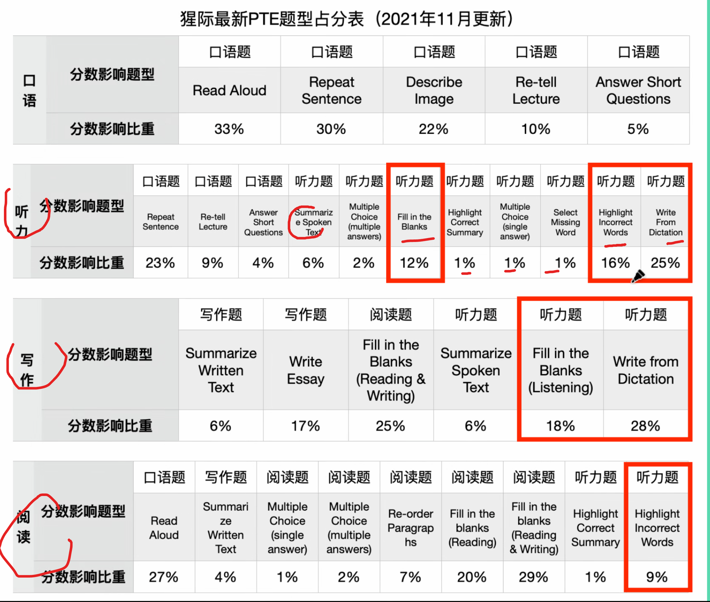
## 周一(听力高分题FIB-L,HIW,WFD)每天都要练
1. HIW(选错误单词)
   - HiW要全对.(平时要1.2和1.5倍速播放,取自生活中的实景)
   - 单击选择
   - 五秒的准备时间,音频只播放一遍
   - 鼠标跟着音频走
   - 默读(至少和音频同步,最好快于音频1.2个词)
   - 千万不纠结,不确定的不选
   - 选对一个词有一分,选错倒扣分
   - 一篇一共是3-7个词
   - 算是送分题
   - 做完之后30s检查一下更正
   - 一般都是实词,虚词一般不挖空
   - 速度一定要跟上
   - 考察的是单词的拼读能力(拼读能力,定位收尾字母)
   - 跟上音频的能力,客观:音频本身就是比较快的,需要大量的练习. 主观: 速度持平,纠结,走神
   - 练习,要用网页练习
   - 分析自己听漏的音节,走神?默读慢了?还是音节漏听了?
   - 如果只作对了3/6就要重新做一遍.不要囫囵吞枣刷题
   - 隔几天在重新做一下错题
   - 用1.2倍速练习10个HIW,如果错误在10个以内,就算掌握HIW了.
   - 练习的时候以原生为主,其他口音都是用ai配音的
2. FIB
   - 一个空一个单词
   - 用tab键(有些考场禁用)
   - 打几个字母就行了,注意时态和单复数. 听的时候就要直接记下来
   - 如果没有听到时态,就在检查的时候检查时态
   - 拼写正确就是1分,拼不对就是0分,控制答题时间,不要超过1.5 mins
   - 注意名词的单复数,单词的时态和语态,ing, ed, s
   - 不要在同一个字上多停留
   - 看得懂不等于听得懂,大量练习循环输入(匹配单词和读音)
   - 将单词从阅读提升到听力层级
   - 可以背FIB-L高频词汇,必须要记背单词
   - 时间紧张的话,可以直接刷WFB
3. WFD
    - 1-2 分钟完成一道题,总共留5-6分钟
    - 写对一个词能得一分, 一个词将近能拿到10分
    - 语序不对也得分, 语序一点也不重要,不考虑顺序
    - 语法一定要正确
    - 标点符号不重要,点没点句号都不影响得分,大小写也不会影响得分.专有名词一定要做出区分!!!(人名,地名,国家名)
    - 不确定的都补上
    - 官方模考中试词是有限制的,真实的考试是没有限制的
    - 加词的数量是不会影响评分的,放心大胆的把所有形式写上去!
    - she is 和 she's 不确定都能写上
    - 试一下从词汇: the, of, to, is, a, in, and, are, for, be, students.
    - a in on of is or to be the and are for this that these those
    - 名词把单数复数都写上
    - 动词检查主谓一致,三单和时态,加词
    - 四步法:
     1. 认真听(不做笔记,理解+意群划分)
     2. 心里回想(非常重要)
     3. 盲打默写,forcast and estimation(不要纠结拼写和语法)
     4. 补充词汇(拼写正确,首字母大小写,句子末尾符号,一般为句号, 不确定的词也加上去)
   - 多做wfd的输入练习,刷wfd的计经
   - 注意一些连读发音 would yell
4. wfd听力循环输入法:
  - 第一步: 听MP3不看字幕,一句话听三遍, 实在听不懂看下字幕,看完后在听3遍.
  - 第二步:重复第一遍的内容, 至少复数80%的内容 
  - 第三步:同样播放20个题目,每播放1题在心里复数,至少过80%就能通过
   the temporary libra will be closed in the winter break.
## 周二(65左右,尽量做,79提高听力,能作对的就不要错)
1. **SST 10分单独计时(包括音频时间,写作时间大概是8:30)**
 - 右上角能看见1 of 1或者1 of 2 50-70字
 - 机经命中率高
 - 满分10分
 - content,有分就行(0.5分就行/2),能区分出主题,
 - 格式要求,格式0分就不向下评分
 - 格式要求:50-70个字,就是2分满分
 - grammar,只要语法完全正确,就可以得满分,1处错误就只有1分了
 - vocabulary只要是合适的单词就能得满分,使用原词原句
 - spelling 拼写满分2分错一个就是1分,错两个就是0分
 - 关键点不准确听力口1分,如果几下来的内容少可以直接使用sst模版
 - **SST需要记句子**
 - SST可以使用模版
 - 边听边记(1-2mins)
 - 编辑答案(5-7mins)
 - 检查答案(2-3mins)
 - 主题句一般出现在开头几句中,提出topic
 - 有四到五个主要观点,每2-3句中有一个主要观点
 - 找语义提示词
 - 表意见:researchers,professional,expers suggest
 - 表结论:as a result, in conclusion turns out that therefore
 - but how
 - 如果能力比较弱,1训练自己听信号词,2句子里的实词(n,v,a,ad,topic是底线)
 - 1. 理解为王:
 - 2. 要记主干:要记下足够的笔记才能记住句子的大意
 - 3. 速记符号:(?=X)和缩写
 - 4. 笔记排版:每个关键点分行记
 - 5. 字迹清晰:以便理解回忆
- 不能用缩写
- 添加是适当的连接词
- 模版如下:
- 
- 模版需要添加1个名词和6个句子
- 一定要达到五十个字,如果达不到50个词,就复制相同的句子
- 模板是不会导致加分和减分,但是会限制关键点的字数
- 笔记内容少才建议使用模板
- 填写的句子要与原句的句意相近
- 不要套词
- 不要同义替换!!!
- 65分简单方法找点,不需要区分句子的主次意思+要听出topic
- 79分听懂文章,找出总结性内容
2. MC多选(倒扣分)
   - 单选是圆圈 多选是方框
   - 选对是1分, 选错会扣分
   - 播放之前先看题目,是correct还是incorrect
   - 五个选项选2个,多于5个选3个
3. HCS(选总结)
  - 听力+阅读
  - 可以选择一个最短的选项来选
  - 1.5min一道
  - 
4. MC单选 1-2个
   - 前面是圆圈,选择一个最优答案
5. SMW 选缺词1分
 - 看题目中的You will heart a recording about xxxx
## 周三()
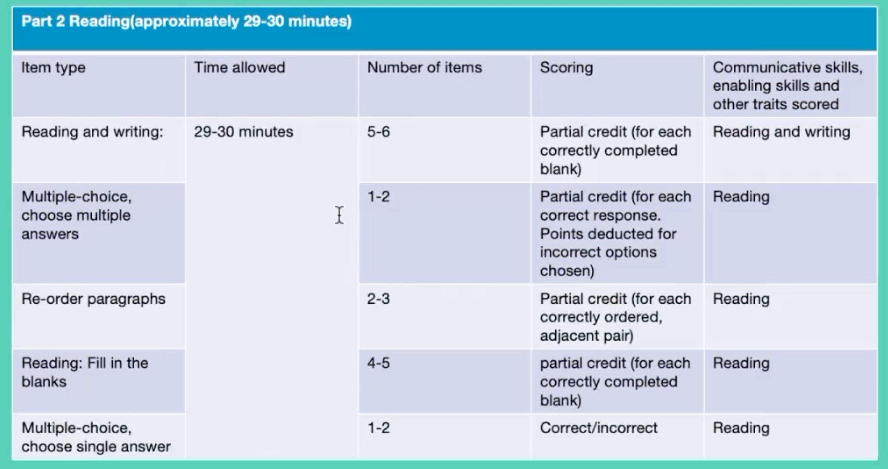

第九张PPT,25mins
1. FIB-R拖拽(刷完所有机经能碰到1-2个原题,****)
- 词性
- 上下文理解
- 空着等待
- 最后选择
2. FIB-RW下拉题(刷完所有机经后能碰到1-3个原题写作29% 阅读29%)
   - 一道题1.5到2min一题
   - 选错不扣分
   - 大部分的时候词性都是一样的
   - 1分一空
   - 50分正确率:50%,79正确率:80%
   - 技巧:
   - 1. 褒贬态度, 感情色彩,态度,正向意义,负向意义的词,挖空词和整体保持一致
   - 2. 显性逻辑关系标志词 but however though whilse
   - 隐性逻辑词: instead of, rather than despite
   - 3. 固定搭配: 
   - 找自己的薄弱项 词汇>语法>文章意思
   - 精度PTE月预测机经
   - 背单词和FIB机经固定搭配
   - 50分-基础词汇,65/79高阶词汇
## 周四
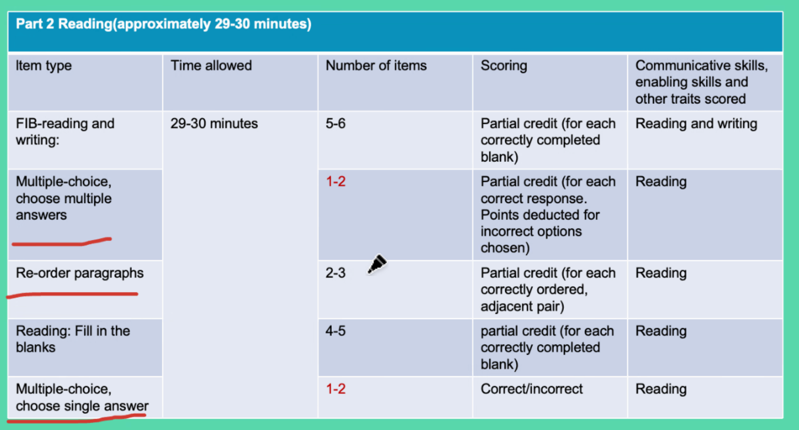
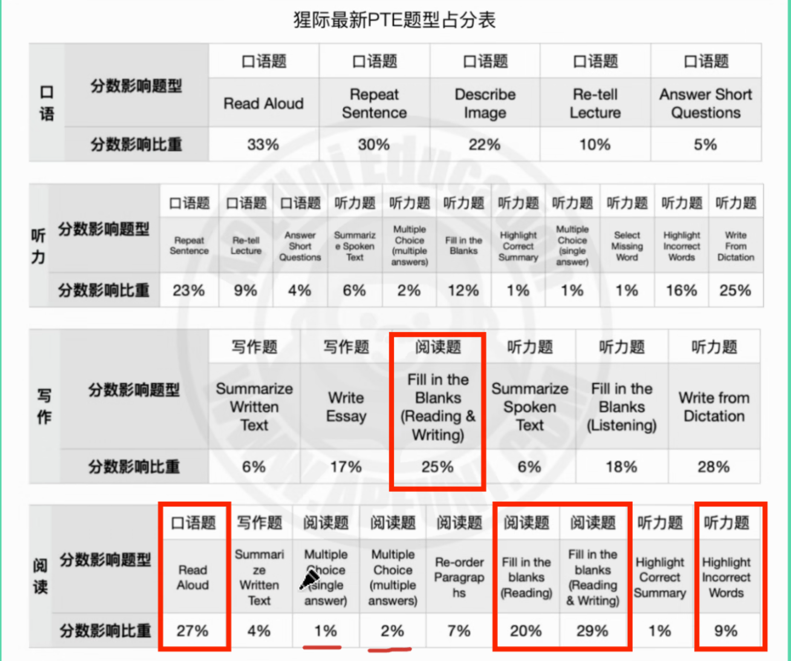
1. MC单选
    -  不要花很多时间来纠结,最多1.5min 基础不好控制在1min,给FIB留时间
   - 答案的可得性不高
   - 读题 >> 看文章 >> 作答
   - 
2. MC多选
   - 直接选一个就走
   - 
3. RO(做到RO要还有15mins,占分 7%)
   - 如果BACED得满分,BCAED得1分,因为一个相邻对得一分
   - 很容易超时,每题最多2 分钟
   - 基础不好得一半就好
   - 答题时间1.5mins
   - 1. 指示词: 找出指示代词.一级指示代词: this, the, he, his, it, their 二级指示代词: the. 没有任何指示代词就是首句.
   - 2. 逻辑词
   - 3. 时间顺序
   - 4. 经验感悟
   - 技巧:
   - 找首句,找配对句,时间关系,逻辑词,逻辑关系
   - 很多的题目有时技巧用不上
   - 注意时间
   - 把机经当做练习题,提高自己的阅读水平
   - 太难的不要纠结
   - 79 对一半就行 65 对25% 50不用管
## 周五WE
   1. WE:
   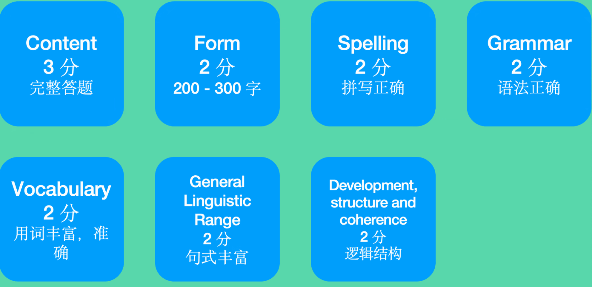
   模板: <br>
    - Nowadays, whether (topic) has attracted numerous controversies and drawn the public’s attention. Some people believe that ... (一个观点), while others hold the view that ... (另一个观点). In my opinion, ... (你的观点) for ... (A) and ... (B) reasons.

    - Firstly, the ... (A) reason is why I think ... (改写你的观点). Although potentially positive/negative impacts of ... (topic里的主语，如电脑，法律等) must be taken into account, I still reckon that ... (topic 里的主语) has in many ways enormously harmed/enriched people’s lives. For example, a well-known American scientist Einstein once said that ... (编一句与主题相关的话). It is thus clearly shown that ... (你的观点).

    - Moreover, another factor that should be considered is the ... (B) reason. As far as society is concerned, the ultimate aim of ... (topic里的主语) is to ... (扣题的话). For instance, a recent article published in/by Scientific American/The Economist revealed that ... (编一句与主题相关的话). Undoubtedly, this is a clear indication that ... (你的观点).

    - To sum up/In conclusion, I hold the view that ... (你的观点). To address this issue, the government and society should make a concerted effort to find solutions.
   - 20 分钟单独计时
   - 占分17%
   - 1-2 min 读题+plan, 12-15 mins写(八分钟内打完全部模版), 3-5mins检查
   - 写满字就是2分 尽量要拿到
   - 拼写错一个就扣一分,错两个就没有分数了
   - 模版可以帮做到用词丰富, 句式丰富, 逻辑结构
   - 问题: 花太多时间想观点, 没时间检查拼写,简单语法错误找不出来, 用错了不熟悉的词组搭配
   - 尽量写简单一点的东西.
   - 文章的结构:
   - 1. 开头表明立场
   - 2. 论点1观点阐述
   - 3. 论点2
   - 4. 总结
   - 
   - 第一段: topic加句子,A和B是adj
   - 第二段: positive/negative要选和第二段开头观点相反的, harm/enriched的选择和第二段观点要保持一致
   - 自己写50个词左右
   - 例文:
   - 完全同意
   - 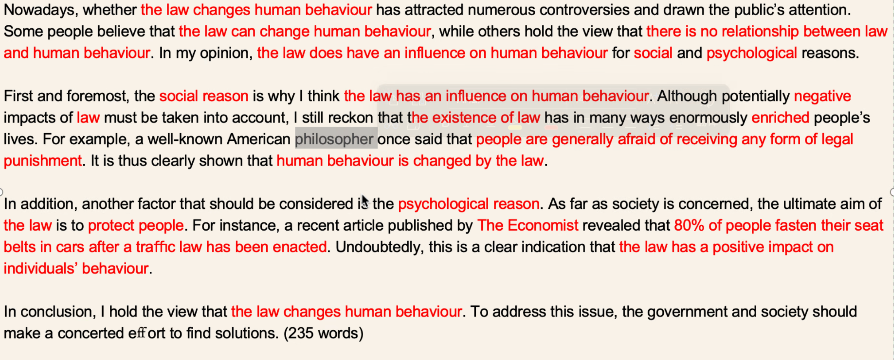
   - largely agree + disagree under some conditions
   - 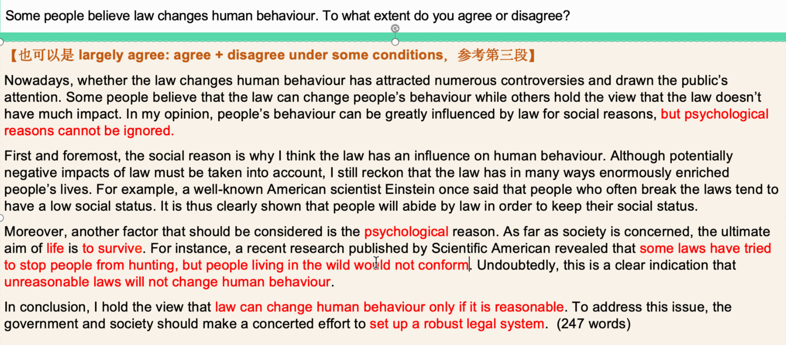
   - 观点类:两个问题,一段写好的原因,一段写不好的原因
   - 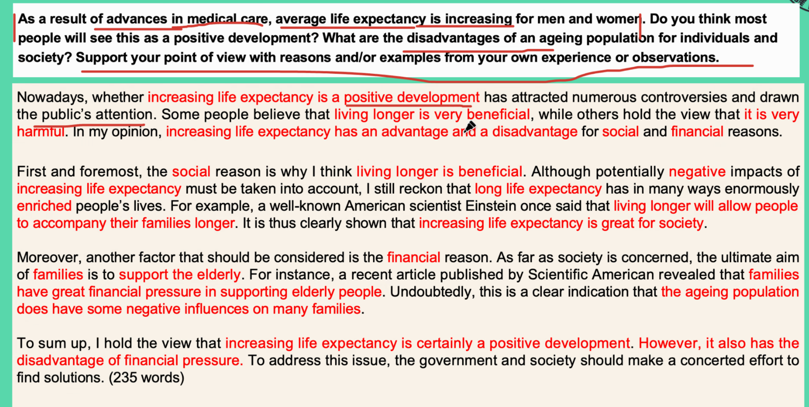
   - 开放性的问题:
   - 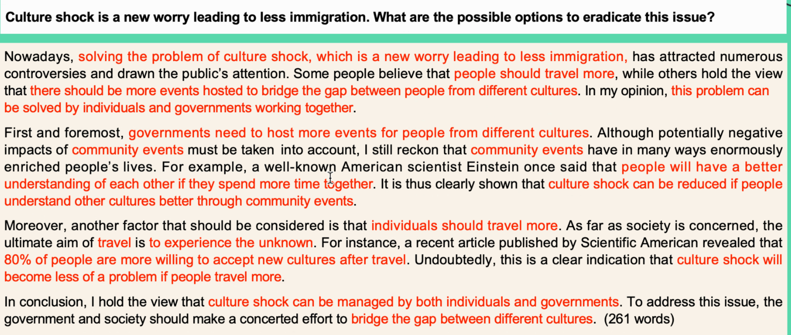
   - 第一段结尾不同,第二段开头不同,第三段开头不同
   - 解题思路拓展:个人类, 一般适用于接地气的个人生活类题目,题目中包含: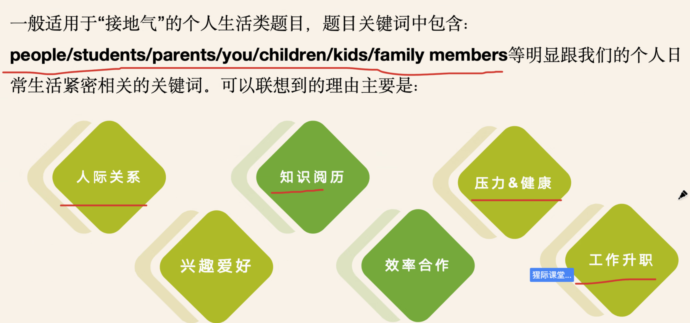
   - 解题思路:社会类, 
   - 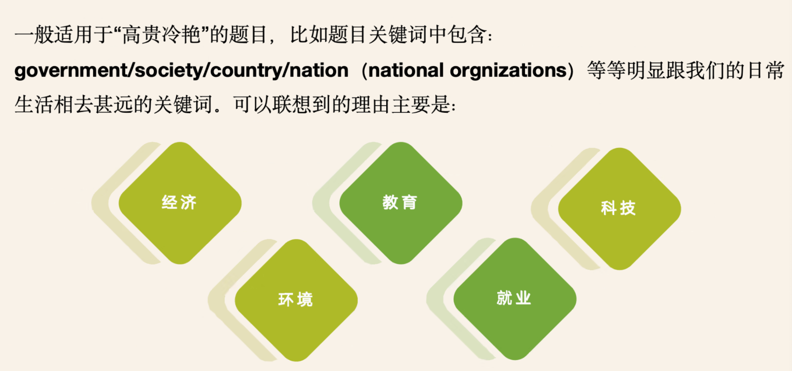
   - 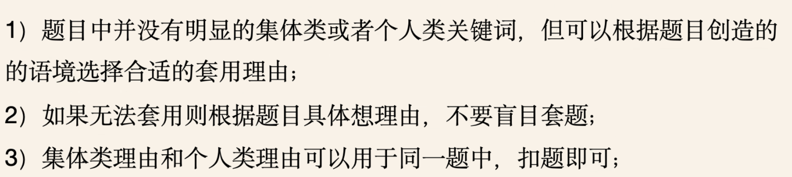
## 周一speaking(RA)
- 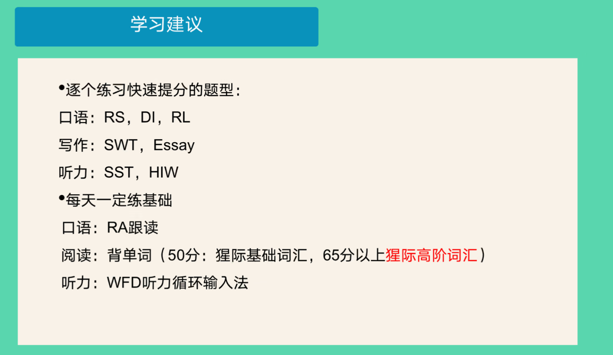
- 麦克风放在鼻头或者下巴
- 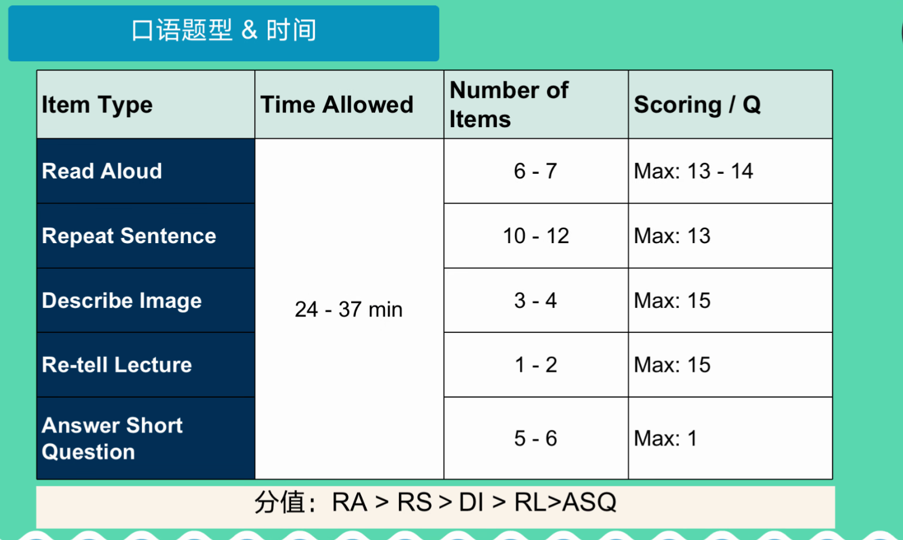
- 做完就点击next
- 
- 可以换词可以漏词
- 内容最不重要
- 发音和流利度都很重要
- 发音>流利度>内容 
- 看B站的纠音视频
- 读错了不要回头再度
- 容错不要错太多,不能错10个
- 速度,按照猩际上同步跟读的 Steven的速度来读
- 有些单词很简单,但是加在一起就不流利,需用利用好30s排查出来
- 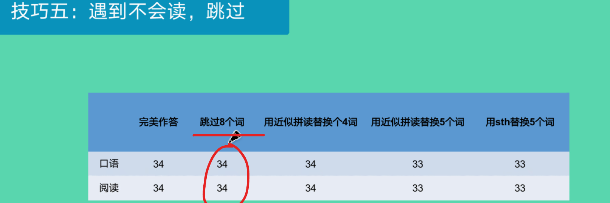
- 直接跳过八个词基本不影响,和sth替换5个词也基本不影响. 不要用其他方法
- 不会的单词确定一个发音
- 准备好断句的地方
- 录音即将开始时,默念(以免被录进去)
- 不完全确定的单词,只要在8个词的范围内直接跳过
- 通读慢:语速慢,单词发音反应慢,断句不熟悉, 纠结(不要去纠结,可以直接跳过)
- 眼睛比嘴快,难词跳过或者换词
- 把握好声音,音量音调平稳
- 不要音量忽大忽小,音量忽高忽低
- 技巧划分意群: 
- 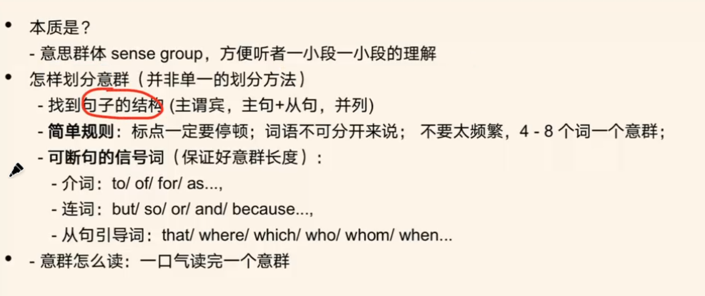
- 在从句引导词的前面停
- I like A, B, C and D 这里逗号停 and 前后都不停,因为刚刚停过
- 主语大于3个词可以停顿
- 意群结尾要用降调
- 有标点符号就要停!
- 重弱读:
- 实词(n/v/adj/adv)要重读, 虚词(can/may/must/should/but/because/人称代词)弱读
- 实词语调升高,虚词相对低.
- **虚词弱读of-ef, to-te, for-fer, can-ken, and-en**
- 连读: 辅音 + 元音要连读
- 爆破: 爆破音(k, g, t, d, p, b)+辅音要失爆, submit importantly obvious
- 失音: bus stop 
- months
- 同步跟读要求:
- step1: 播放一句原声(慢速版本), 自己读一句模仿他的语调, 断句,失爆, 连读 不卡壳
- step2: 同步跟读慢速版本.一字一句都应该是同一个速度
- step3: 脱离原声, 自己读
- 作业方法:
- 1. 首读: (常速+评分链接)
- 2. 同步跟读: 慢速+两个设备+音频文件
- 3. 跟读后的自读: 常速+评分后的链接
- 不要一味追求快
## 周二(ASQ, RS这两个题型没有提示框)
1. ASQ
   - 没有提示音! 
   - 非选择题中只要正确答案涵盖在给出的答案之中就能得分(a chronology timeline, the chronology the timeline, It's called a chronology timeline)
   - 听到how many可以直接猜,从1念到10
2. RS
   - 基础+技巧的题
   - 一般有9-14个词
   - 没有提示音!!!
   - 进度条走一格开始回答, 不建议立马作答
   - 练习抗干扰的能力
   - 3分content 说80%其实content就有满分, 说满50%就能拿到2分
   - 语法不重要,但是语序很重要,不能颠倒
   - 不要犹豫, 含糊和自我纠正
   - 模仿发音的风险很大, 说自己听懂的东西
   - 有正确的重弱读
   - 结尾一定要用降调, 不然会被扣分
   - 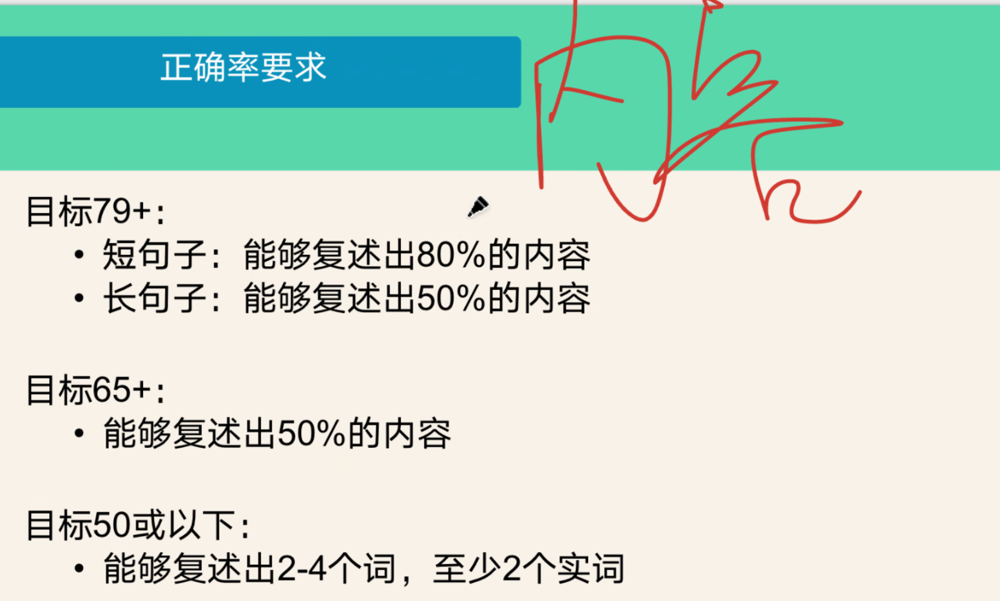
   - 八十分的话说个7或者8个词就行了
   - 50分只要说出两个实词就可以
   - 误区:
   - 1.  内容最重要, 发音流利度没有重要作用
   - 2. 重弱读, 断句, 发音只在RA中注意(注意考试中不用断句!!!!!)
   - 3. 一定不要模仿, 及语速, 及时发音模糊也要这样做.(一定要匀速, RA和RS都要一样的速度)
   - 258技巧:
   - 9-14个
   - 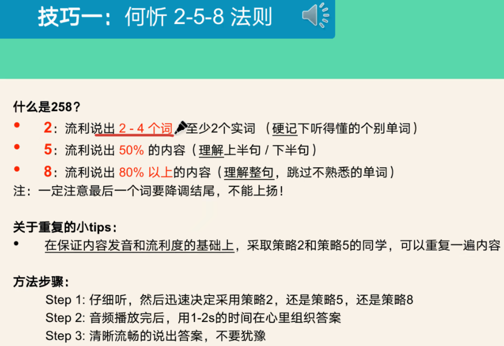
   - 超过四个词可以不用重复, 四个词一下可以重复两边就行了!!
   - 重复不要停顿
   - 听的时候就要决定用什么策略, 是策略1, 策略2, 策略3
   - 播放完之后要在心里组织好答案( 过一遍内容, 说什么才能说的最好, 需不需要重复)
   - 清晰说出答案, 不要犹豫
   - 刷完月预测可能可以碰到原题, 也可能有WFD的原题
   - 难题一定要忽略难词, 只说能听懂的两个词
   - 5法则, 只能听懂一半以上(前半句/后半句/零散内容的累加)不贪心, 专注
   - 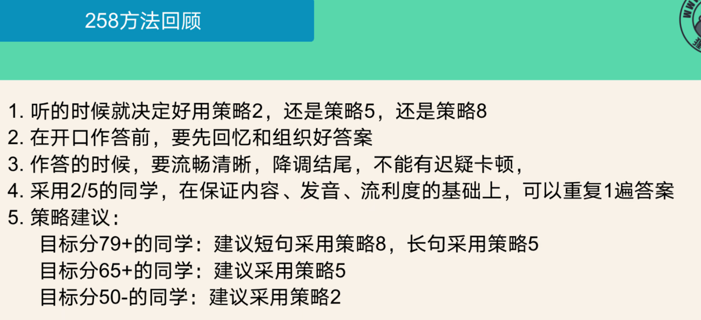
   - **一定不要思考纠结, 模仿听不懂的/模棱两可的, 说迅速反应的内容:发音流利度才会好**
   - 做题步骤养成习惯
   - 心态
   - 专注力, 忽略听不懂的
   - 不要贪心
   - 对题目难易程度的感知
   - 语块记忆, 方便听的人一小节一小节的理解
   - 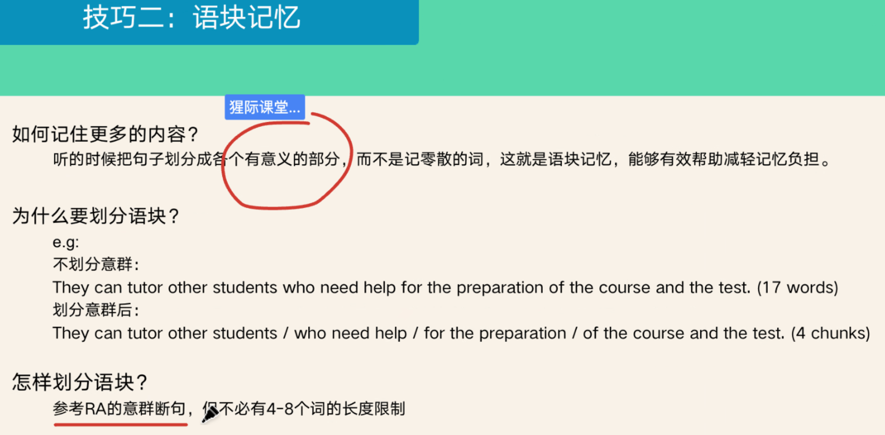
   - 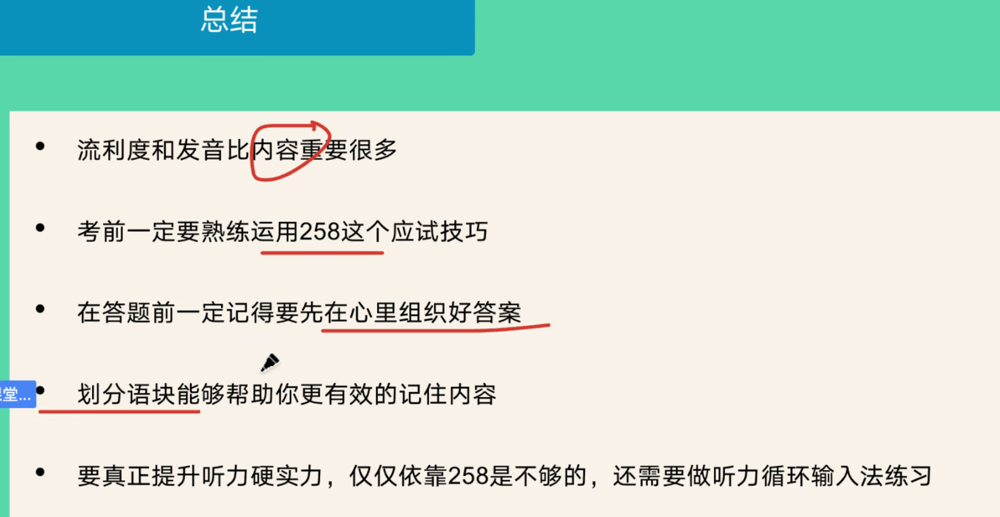
## 周三(DI)
1. DI
   - DI 25s的准备时间, 40s的答题时间, 录音开始时候会有提示音, 沉默三秒就结束.
   - 不用说满40s, 建议&frac34;时就说完,大概30s, 不要超过35s
   - 建议: 使用猩际满分模版, 提及图片上至少8个词, 维持大概25-30s的作答
   - 作答时不要在乎语法
   - 需要雨露均沾,不能只说一种元素
   - 要语速均匀
   - 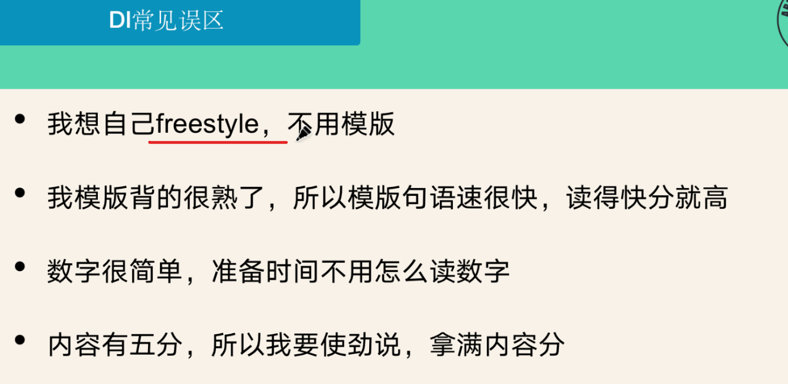
   - 一定要把模版弄熟
   - 可以比ra, rs快一点点
   - 模版是发音和流利度的保证
   - 模版:
   - 所有的标点符号都要停顿,逗号和所有的意群停顿都是0.5s, 句号和感叹号问号1s左右
 ```
 The following graph gives information about +标题.(标题如果太长可以可以选词读)

It is a very useful graph. (It is a 虚词连词快读)

According to the graph, I notice + 关键词1 and 关键词2. (according要重度 to 弱读)

From the graph, I find + 关键词3 and 关键词 4. (From the 要弱读 graph要重度)

What's more, it shows the highest is 关键词5 and the lowest is 关键词6.(highest-is 连读, lowest-is连词)

Finally, there is/are 关键词 7 and 关键词8.  （PS：there is，there are哪个顺口读哪个，因为口语不考察语法）

To sum up, this graph tells a lot./ In conclusion, the picture is very informative/useful/improtant/interesting.
```
- 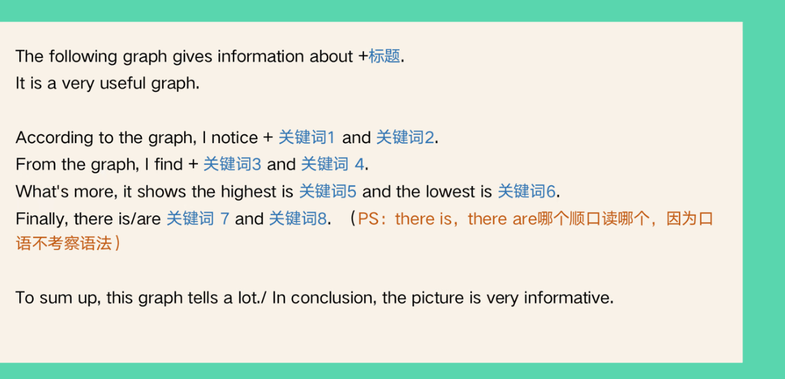
- 不确定的单词不要读
- 年份的读法
- 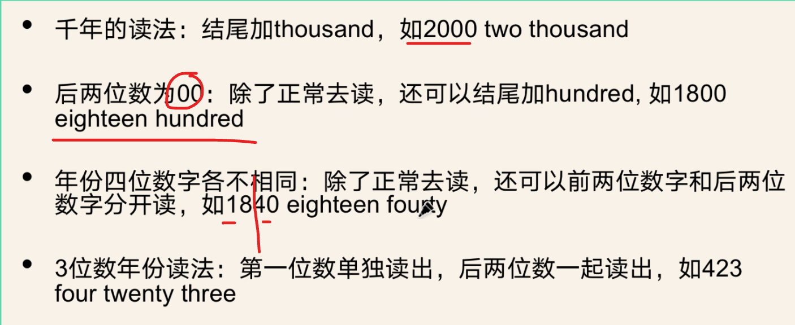
- 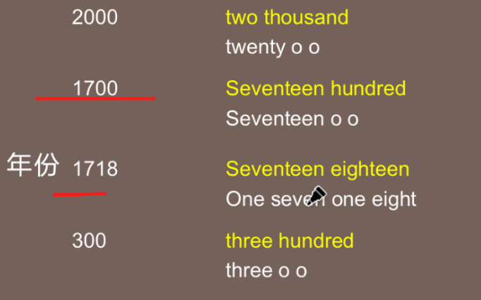
- 4000 four thousand
- 1700 seventy o o
- 2014 twenty fourteen
- 2050 twenty fifty
- 888 eight eight-eight
- 纯图片:
- 1. 可以描述物品名称或者颜色
- 2. 由大到小, 先具体后抽象
- 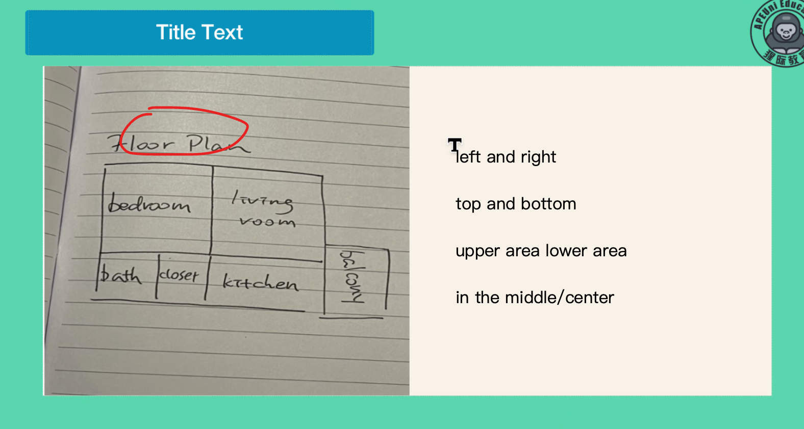
- 形状 颜色 内容不够, step来凑(First step, second step, step one, step 2)
- 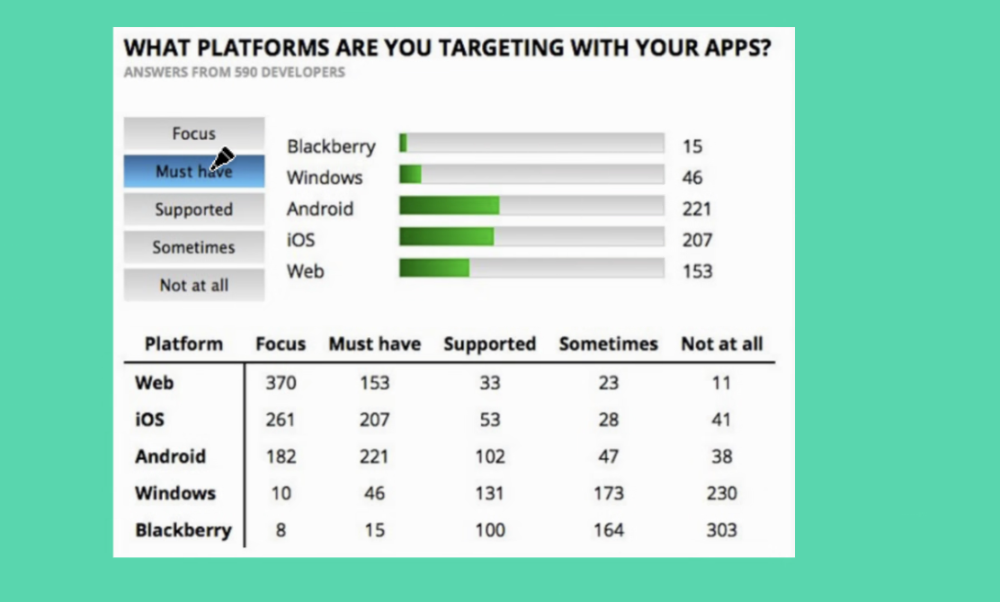
- 按照顺序说 先说大再说小,先具体在抽象
- 可以用笔直接写下来所有的单词 用and链接一个句子中的两个词,读两遍
- 碰到大数字,直接估读,最大单位
- 一个逗号是thousand, 两个逗号是million, 三个逗号是billion
- percent 是这个符号 , percentage是百分之
- 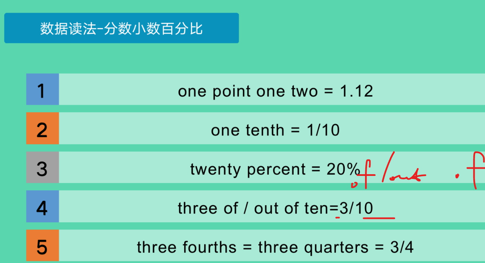
- 不可以约分!!!
- 模版一定要滚瓜烂熟,脱口而出,不假思索. **模板和关键词之间不要停顿**
- 要充分利用准备时间
- 不要过度追求内容过多, 内容准确就行!
- 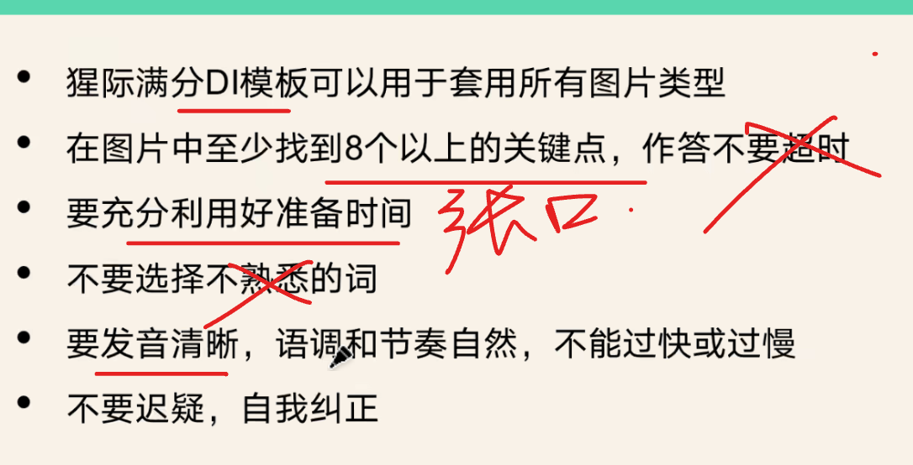

## 周四(DL)
1. DL
- 音频长度60-90s, 十秒准备, 40s答题,有提语音, 沉默3s结束
- DL有两个框
- 要花10s来筛选笔记
- 主题词一定出现在lecture开头. 所以要仔细听lecture的开头
- 如果没有听见主题词,就随便找一个听到的内容
- 尽可能多记实词,可以记十二个左右
- 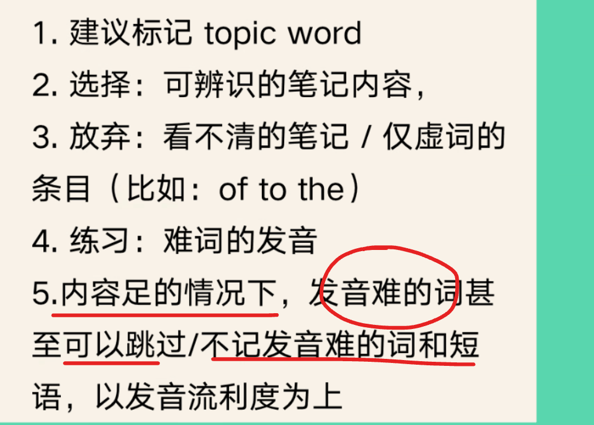
- 模版:
- 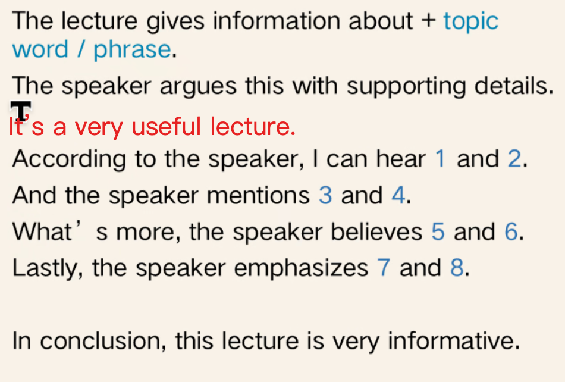
- emphasize可以改成talk about或者point out
- 听到了10-12 个实词就可以不用听接下来的音频了, 可以直接开始检查 
2. RA(一句话)
   - 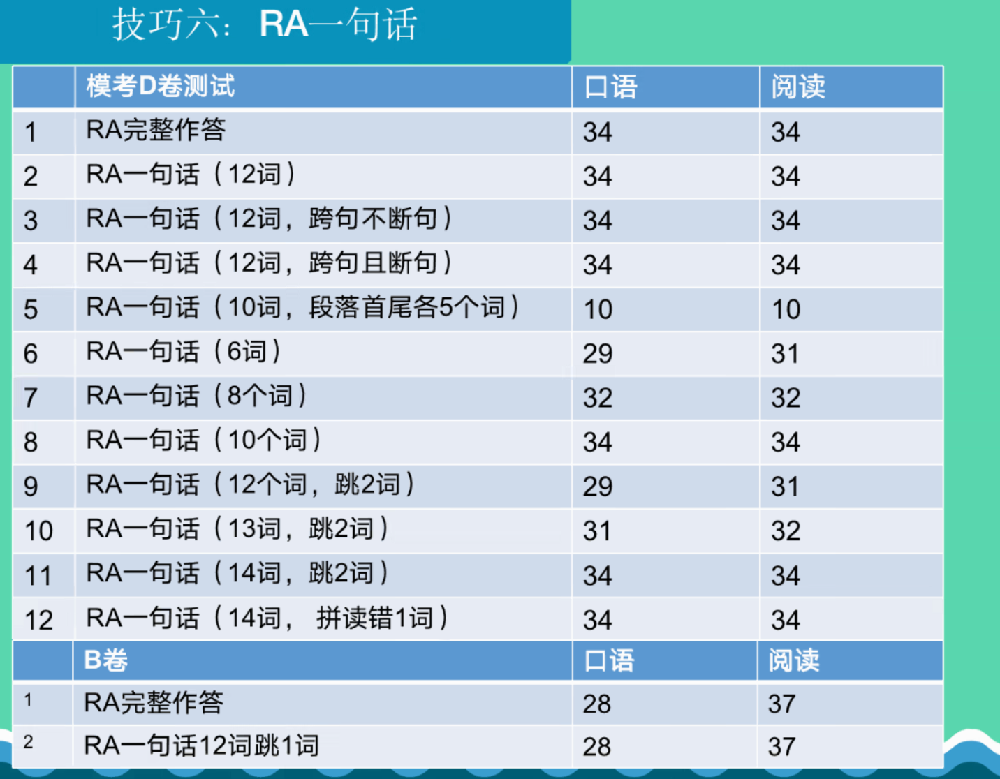
   - 必须挨着, 14个词
   - 实在不能读才读一段话
   - 用跳过技巧,不要用something技巧
   - 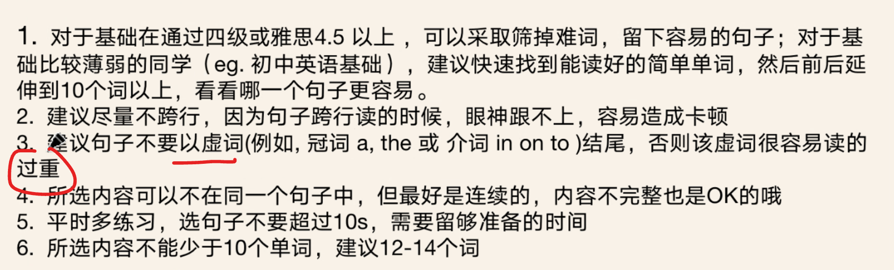
## 周五(SWT)
1. SWT:
   - 有可能出现一到两道
   - 是单独计时,10mins
   - 写作6分 阅读4分
   - 5到75字
   - 直接照抄句子, 平时练的时候不要复制粘贴
   - 花 3-4 mins找关键句, 3-4 mins打字 最后留出时间来检查
   - 满分7分, 内容2分(关键句子到达80%以上就能拿满分了, 50%-60%能拿1分, 一个关键词都没拿到就是0分) 格式1分(如果没有拿到分数, 就是0分, 只有一个句子)
   - 内容是用多个句子链接起来成一个完整的句子
   - 大概要抄5句话
   - 语法和词汇都是2分
   - 可以使用猩际SWT模版, 可以使用一个分号, 不用概括, 关键点不对会被扣分
   - 选取4-5个关键句
   - 不选:
   - 1. 选与不选真纠结, 
   - 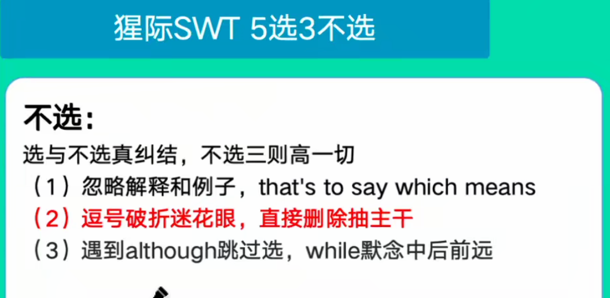
   - 主句和从句之间有逗号隔开是非限制性定语从句,可以删除, 如果没有逗号,就是限制性定语从句, 不能删除. 举例子可以删除. including involving...
   - 插入语(可以删,两个逗号之间的不用选, 两个破折号之间的不用选, 两个逗号都不要)
   - 抄句子的时候都不用保留句子中的标点符号.
   - Although让步不用选, 直接找后半句即可
   - while可以做时间状语从句,相当于when. while可以用作转折, 相当于but, 意思是然而. while放在句子开头, 表虽然
   - while用中后前远,while在句中就用跟在while后面的, while在句首, 就用while逗号之后的
   - 看到but多数要, 直接抄but之后的内容
   - 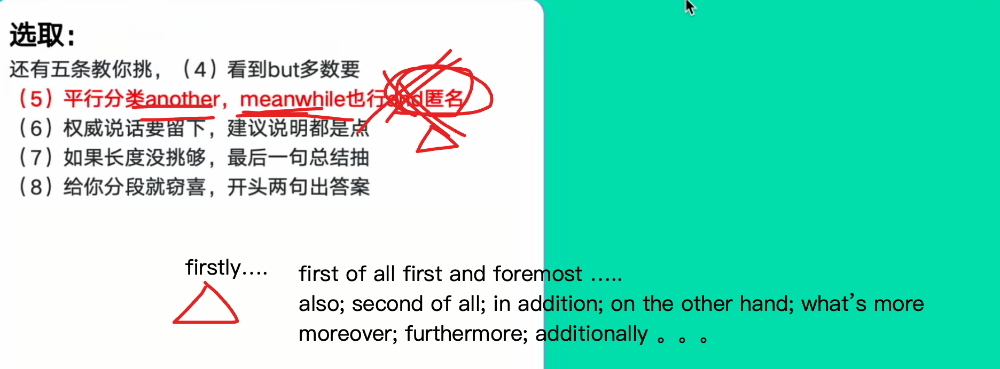
   - 看见Another前后两句都是, meanwhile后面的一定是重点
   - 权威说的话都要留下, Research Dr. , 大写的机构杂志名称, 间接引语没有双引号, 直接引语有双引号,我们要选间接引语只抄引用的内容不要抄谁说的, 直接引语不要选
   - 终结句就是一定要写
   - 议论文会分段, 要直接锁定每一段的开头, 议论文一般是总分总分,只适用于议论文
   - 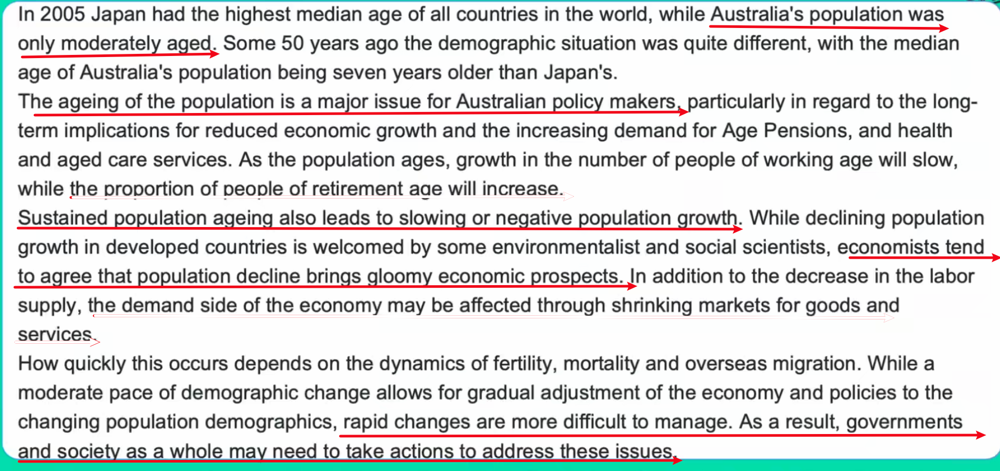
   - 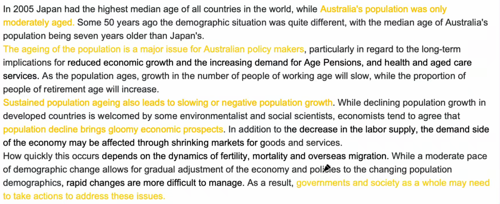
   - 如果多余5个就删改成5个
   - 模版:
   - 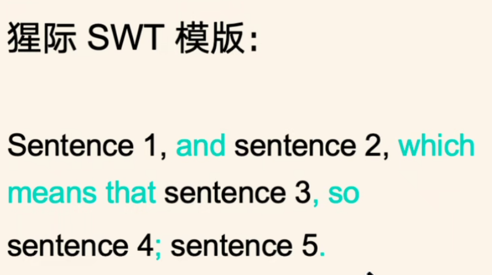
   - 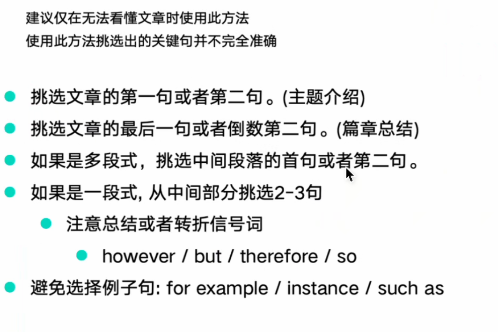
   - 不要抄链接词或者链接副词
   - 如果看不懂采用下面的内容:
   - 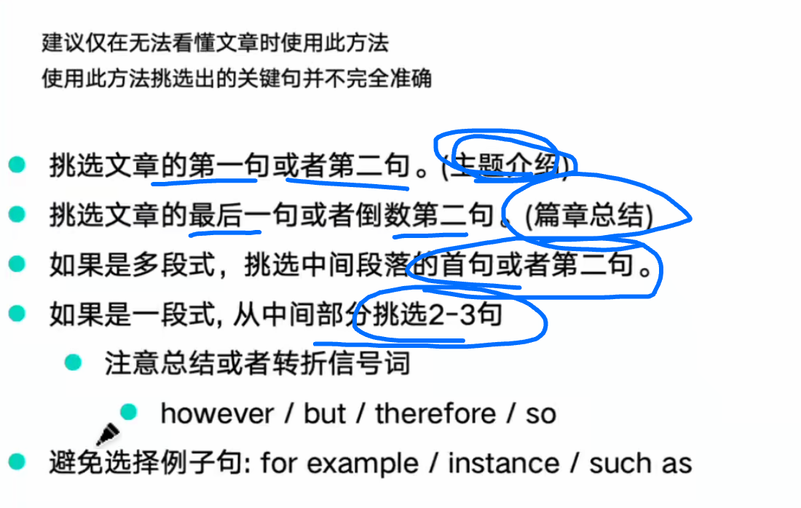
   - 语法排查:
   - 1. 多余一个句号, 没有连接词
   - 2. and使用多次
   - 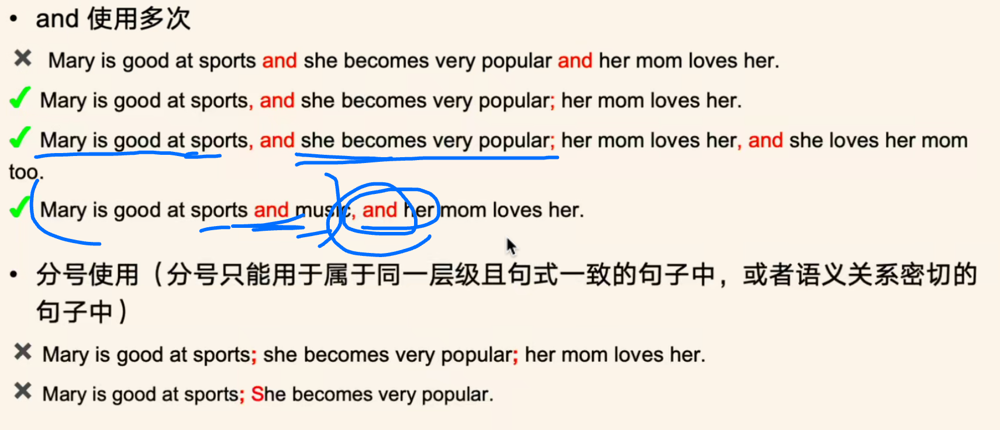
   - 3. Diasporas are getting large, sticker and stronger, and diaspora consciousness is on the rise, which means that host countries are witnessing more assertive diasporic groups within their own national communities, so this trend is the result of five factors, all of them connected with globalisation; they will continue to grow.
   - 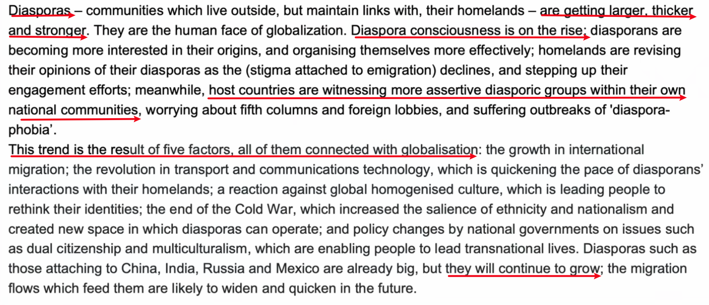
   - 冒号前面的内容也可以选!!
   - 尽量按照文章中的顺序去写
-----------------
# RS词组: 
1. on and off campus 校园的线上和线下
2. capacity to serve the community  服务社会的能力
3. balanced diet 均衡的饮食
4. study more effectively 提高学习效率
# 词组
1. refer to sth as sth 把sth认为是什么
2. quality 特征 
3. less accessible


# RA 单词发音
1. written  /riten/
2. Analysis 
3. various /ˈveəriəs/
4. awareness
5. volcanic
6. molten /ˈməʊltən/
7. explanations
8. tongue /tʌŋ/
9. tutorial /tju:ˈtɔ:riəl/
10. following
11. silver
12. traditional  [trəˈdɪʃənl]传统的  
13. countries
14. mutual
15. politics /'pɒlətɪks/
16. diverse


# WFD 单词拼写
1. formed 形成(过去式)
2. literature 文献
3. description 描述
4. fascination 魅力
5. maybe和may be都要试
6. accommodation住宿
7. suppose 
8. temporary
9. winter
10. television
11. laboratory
12. worn (wear的过去式)
13. responsible有责任的
14. rural 农村
15. agricultural 农业的
16. transformation [n] 转变；（用于南非）民主改革
17. dedicate [v] 把…奉献给；（在书、音乐或演出的前部）题献词；为…举行奉献典礼
18. Gravity [n] 重力；严重性；严肃；地球引力
19. experiment [n] 实验；试验；尝试；实践
20. horizontal line水平线
21. modern 现代的
22. professional专业的
23. opportunity 机会
24. scholarship 奖学金
25. variety 许多
26. theater
27. seminar
28. archeologist
29. phenomenon
30. compound
31. presenters 
32. **eye contact**
33. Practical
34. practical
35. physics
36. mechanics
37. mathematics
38. fund资助
39. laboratory
40. contemporary
41. regulation
42. geography地理学
43. demography人口学
44. biased
45. mislead原型 misled误导
46. coverage
47. worldwide
48. inflation通货膨胀
49. population后面+三单
50. individualities个性
51. various 形容词
52. varies 动词三单

# FIB 单词拼写
1. physician 医生
2. physicists [n] 物理学家；物理学研究者
3. psychological 心理的
4. physical 身体上的 
5. expertise 专长expertise
6. preliminary 初赛
7. physicists  物理学家
8. magnetism 磁性；磁力；吸引力；魅力
9. hierarchy 层次体系；等级制度（尤指社会或组织）；统治集团
10. exception [n] 例外；一般情况以外的人（或事物）；规则的例外；例外
11. analysts [n] 分析者；化验员
12. constant 常数
13. deforestation [n] 毁林；滥伐森林；烧林
14. vary 改变
15. spread 传播
16. categorized [v] 将…分类；把…加以归类
17. Essentially [adv] 基本上；本质上；根本上
18. realists [n] 现实主义者；务实的人；现实主义作家（或画家等）
19. license 驾照
20. bored [n] 钻孔；口径；（常因话多）令人厌烦的人；烦人的状况（或事情）
21. irrelevant [adj] 无关紧要的；不相关的
22.  prerequisite n. 先决条件 ,adj. 首要必备的
23.  hypothesise v. 假定，假设
24.  summarized v. 总结，概括；概述（summarize的过去式及过去分词形式）
25.  contents n. 内容；[图情][计] 目录；要旨（content的复数） ,v. 使满意（content的三单形式
26.  staring adj. 凝视的，目不转睛的；瞪着眼的；显眼的；怪俗气的；（头发）倒竖的 ,v. 凝视；盯着看；显眼，明摆在某人面前；目不转睛把……看得（stare 的现在分词）,n. (Staring) （美、荷、瑞典、加）斯塔林（人名）
27.  predominant adj. 主要的；卓越的；支配的；有力的；有影响的
28.  sleek adj. 圆滑的；井然有序的 ,vt. 使…光滑；掩盖,vi. 打扮整洁；滑动
29.  mammals n. [古生] 哺乳类；哺乳类动物（mammal的复数）；哺乳纲
30.  socio-economic adj. 社会经济的
31.  muscle 肌肉 
32.  pendulum  n. 钟摆；摇锤；摇摆不定的事态 
33.  oceanographer n. 海洋学家；海洋研究者 
34.  countries 国家 country的复数 
35.  immense 巨大的 
36.  vertical adj. 垂直的，直立的；[解剖] 头顶的，顶点的；[植]纵长的，直上的 ,n. 垂直线，垂直面；垂直位置
37.  nutrients 营养盐 ,[食品] 营养素 
38.  mathematical adj. 数学的，数学上的；精确的 mathematical
39.  mathematics 数学
40.  droplets n. [流] 液滴（droplet的复数）；飞沫
41.  envisions 想像，展望（envision的第三人称单数）
42.  trajectory n. [物] 轨道，轨线；[航][军] 弹道 
43.  obesity n. 肥大，肥胖
44.  premium n. 额外费用；奖金；保险费;(商)溢价 ,adj. 高价的；优质
45.  burgeon v. 萌芽, 发芽；迅速增长 ,n. 芽, 嫩枝
46.  incorporating adj. 合并的 ,v. 合并（incorporate 的现在分词）
47.  behaviour
48.  apologise
49.  phonograph 留声机 
50.  stitch n. 针脚，线迹
51.  urgency 紧急的事
52.  compossible adj. 可共存的
53.  splashes n. 色斑；散点（splas的h复数
54.  implement vt. 实施，执行；实现，使生效 ,n. 工具，器具；手段
55.  unashamedly adv. 无愧地；厚颜无耻
56.  occurrence n. 发生；出现；事件；发现
57.  encyclopedia n. 百科全书（亦是encyclopaedia）
58.  personalised adj. （英）个人化的（等于personalized）
59.  squabble v. （为琐事）发生口角，大声争吵 ,n. 争吵，口角
60.  ecological adj. 生态的，生态学的
61.  insights n. 洞察力；眼力；深刻见解（insight的复数）
62.  concentrate 集中注意力
63.  anxiety anxious
64.  population 不可数
65.  legitimate adj. 合法的；正当的；合理的；正统的 ,vt. 使合法；认为正当（等于legitimize）
66.  engine 引擎
67.  pragmatic adj. 实际的；实用主义的
68.  tremendously adv. 非常地；可怕地；惊人地
69.  fundamental adj. 基本的，根本的 ,n. 基本原理；基本原则
70.  diseases n. [医] 病（disease的复数）；[医] 疾病；[植保] 病害；疾病种类
71.  leans n. 倾斜；倾斜错觉（lean的复数） ,v. 倚靠（lean的第三人称单数形式）
72.  ridiculous 荒谬的,可笑的,荒唐的,好笑的 Ridiculous Thoughts:天马行空,胡思乱想,荒谬的想法,荒谬的思想 Ridiculous reality:荒谬的现实
73.  protection 保护
74.  supplemented v. 增补，补充（supplement的过去分词）
75.  saturated adj. 饱和的；渗透的；深颜色的 ,v. 使渗透，使饱和 (saturate的过去式)
76.  scenario n. 方案；情节；剧本；设想
77.  envision vt. 想象；预想
78.  robust adj. 强健的；健康的；粗野的；粗鲁的
79.  observe vt. 庆祝 ,vt. 观察；遵守；说；注意到；评论,vi. 观察；说；注意到；评论
80.  graphic adj. 形象的；图表的；绘画似的
81.  boundary
82.  evoke vt. 引起，唤起；博得
83.  strategy
84.  alliance n. 联盟，联合；联姻
85.  ingredients n. 材料；佐料
86.  statics 静力学
87.  investigators n. 研究者，调查者（investigator的复数形式）；[法] 审查者（investigator的复数形式）
88.  invisible adj. 无形的，看不见的；无形的；不显眼的，暗藏的
89.  instinct n. 本能，直觉；天性 ,adj. 充满着的
90.  emphases n. 重点（emphasis的复数形式）
91.  fossil
92.  extreme
93.  exposure n. 暴露；曝光；揭露；陈列
94.  creed n. 信条，教义 ,n. (Creed)人名；(英)克里德
95.  illusion n. 幻觉，错觉；错误的观念或信仰
96.  opportunity 机会
97.  in attempt to do sth/pay attention to
98.  quality质量
99.  quantity数量
100. qualification 资格
101. quantification 量化
102. regulate 调节
103. relatives 亲属
104. deformed adj. 畸形的；丑陋的；残废的 ,v. 使……残缺；使……变形（deform 的过去式和过去分词
105. empathy n. 神入；移情作用；执着；感同身受；共鸣
106. radically adv. 根本上；彻底地；以激进的方式
107. commence v. 开始；着手；<英>获得学位
108. attuned 熟悉理解
109. incorporate vt. 包含，吸收；体现；把……合并 ,vi. 合并；混合；组成公司,adj. 合并的；一体化的；组成公司的
110. temporary adj. 暂时的，临时的 ,n. 临时工，临时雇员 
111. approach v. 走进；与……接洽；处理；临近，逐渐接近（某时间或事件）；几乎达到（某水平或状态） ,n. 方法，方式；接近；接洽；（某事的）临近；路径；进场（着陆）；相似的事物
112. spectacle n. 景象；场面； 
113. calories 卡路里
114. deliberately 故意地
115. latter adj. 后者的；近来的；后面的；较后的 ,n. (Latter)人名；(英、德、捷)拉特
116. clot n. 凝块，黏团
117. shadow 影子
118. shed vt. 流出；摆脱；
119. ravel 解开弄明白
120. dramatically
121. illustrative adj. 说明的；作例证的；解说的
122. naval 海军
123. pollination 农学
124. vernacular 土话, 本地的
125. consecutive 连续的
126. confessed adj. 坦白的，认罪的；众所公认的，不容怀疑的，公开的，众所周知的 ,v. 坦白；承认（confess 的过去式和过去分词
127. opposed 反对的
128. recognition 标记识别
129. curiosity
130. curious
131. propulsion [n] 推进；推动力
132. emergence emergency
133. planet 星球
134. characteristic [n] 特征；特点；品质
135. initiated [v] 开创；开始；提出；制定 
136. hone [v] 磨练；想念；用磨刀石磨；磨光
137. live 生活方式复数是lives
138. life 生命,复数是lives
139. fundamental [n] 基础；基本原理；基本规律；根本法则
140. compatible [adj] 兼容的；可共用的；可共存的；（因思想、志趣等相投而）关系好的
141. habitable [adj] 适合居住的
142. subscribe [v] 预订；申请；定期订购（或订阅等）；定期交纳（会员费）
143. electronically [adv] 用电子方法；用电子装置
144. permeate [v] 渗透；弥漫；扩散；感染
145. eliminate [v] 消除；消灭；清除；淘汰
146. cast some doubt 产生一些怀疑
147. rarely
148. authors
149. relative
150. clout n. 破布；敲打；影响力；势力 ,vt. 给…打补钉；猛击,n. (Clout)人名；(法)克卢
151. terrestrial adj. 地球的；陆地的，[生物] 陆生的；人间的 ,n. 陆地生物；地球上的人
152. nitrogen n. [化学] 氮 
153. mysterious adj. 神秘的；不可思议的；难解的
154. rammer n. 撞者；捣槌；装填器 ,n. (Rammer)人名；(德、匈)拉默
155. primary adj. 主要的；初级的；基本的 ,n. 原色；最主要者 
156. alliances n. 联盟，同盟；盟国（alliance的复数形式）；联姻
157. align 对齐 
158. theories 理论 theory
159. percent 百分比
160. assess 评估评价 assess
161. ponds 水塘复数 ponds
162. pounds n. 磅，英镑；重击（pound复数形式）
163. debit 借记卡 debit
164. debate n. 辩论；（正式的）讨论 ,v. （尤指正式）讨论，辩论；仔细考虑
165. ancient 古代的 ancient
166. horns n. 喇叭；号；角制品；警报器（horn的复数） ,v. 截锯…的角；用角抵撞；给…装角（horn的三单形式）,n. (Horns)人名；(瑞典、英)霍恩斯 horns
167. sequentially adv. 从而；继续地；循序地 
168. balloons气球 
169. hemisphere n. 半球 
170. characters n. 特性；人物角色（character复数） ,v. 描述（character的三单形式）；表示…的特性 
171. extol vt. 颂扬；赞美；赞颂
172. journal 期刊 journal
173. autograph n. （名人的）亲笔签名
174. graphics n. （商业设计或插图中的）图形；图样
175. swapping 交换 
176. concussive adj. 震荡性的；给与冲击的
177. qualifiers 限定词(复数)
178. Arctic 北极
179. spreads 传播
180. benefited adj. 受益的 ,v. 受益（benefit的过去式）
181. particles n. 微粒，粒子；粒子系统；碎木料（particle的复数形式）
182. launching
183. faith
184. symptom n. [临床] 症状；征兆
185. vacuum 真空吸尘器
186. supermassive adj. 特大质量的
187. propulsion n. 推进；推进力 
188. discursion 离题
189. technology
190. technological
191. journalism n. 新闻业，新闻工作；报章杂志
192. offspring 后代
193. dinosaurs恐龙
194. steadfast adj. 坚定的；不变的
195. prosperity n. 繁荣，成功
196. stretching 拉长
197. frontier n. 前沿；边界；国境 ,adj. 边界的；开拓的,n. (Frontier)人名；(法)弗龙捷
198. cautionary adj. 警告的；劝诫的
199. migration n. 迁移；移民；移动
200. circuit n. [电子] 电路，回路；巡回；一圈；环道 ,vi. 环行,vt. 绕回…环行
201. discovery
202. imagining v. 想像；猜测；料想（imagine 的现在分词形式）
203. conversation 谈话交流
204. mentioned v. 提及，说起，谈到（mention 的过去式和过去分词）
205. circulation
206. immune adj. 免疫的；免于……的，免除的 ,n. 免疫者；免除者 
207. supplemental adj. 补充的（等于supplementary）；追加的
208. initially 最初的
209. bounds n. 界限；跳动（bound的复数） ,v. 跳跃；弹回；限定；邻接（bound的三单形式）,n. (Bounds)人名；(英)邦兹
210. grapher n. 记录仪；[仪] 自动记录器
211. circular quay
212. principally adv. 主要地；大部分
213. bond n. 债券；结合；约定；粘合剂；纽带 ,vi. 结合，团结在一起,vt. 使结合；以…作保,n. (Bond)人名；(英、德、西、刚(金)、瑞典)邦德
214. aesthetic 美学的 
215. sub-letting Sub-letting:分租,合同分判员,分判经理,转租 sub-letting rental income:收入
216. controversial adj. 有争议的；有争论的
217. bored 无聊的
218. acknowledge
219. technologies 技术复数
220. observable adj. 显著的；觉察得到的；看得见的 ,n. [物] 可观察量；感觉到的事物
221. earnestly adv. 认真地；诚挚地
222. consistency n. [计] 一致性；稠度；相容性
223. equities 股票复数 stock
224. predator 捕猎者
225. traditional 传统的  
226. contemporary 当代的
227. beneath 在下方
228. portraits portrait肖像
229. predicament 窘境 dilemma 窘境
230. tokyo
231. Korea
232. coalition n. 联合；结合，合并
233. confess vt. 承认；坦白；忏悔；供认 ,vi. 承认；坦白；忏悔；供认
234. rustic rural 乡村的
235. passenger n. 旅客；乘客；过路人；碍手碍脚的人
236. mutate 变化
237. separated separated
238. competitions
239. autumn
240. enormously numerous
241. perspective n. 观点；远景；透视图 ,adj. 透视的
242. swings n. 摇摆，改变，冲力（swing的复数形式）；（复数）秋千 ,v. 摇摆，使…旋转（swing的单三形式）,n. (Swings)人名；(德、荷)斯温斯
243. shallow 浅的肤浅的
244. pedal 踏板
245. deduction 减去
246. baffle vt. 使…困惑；使…受挫折；用挡板控制 ,n. 挡板；困惑,vi. 做徒劳挣扎
247. compel vt. 强迫，迫使；强使发生 ,n. (Compel)人名；(法)孔佩尔
248. tension n. 张力，拉力；紧张，不安；电压 ,vt. 使紧张；使拉紧
249. covert 隐蔽的
250. coaching n. 辅导；教练技术 ,v. 指导（coach的ing形式）
251. celebrate
252. dispersal n. 分散；传播；散布；疏散；消失
253. taught v. 教授（teach的过去分词）
254. sculpture  n. 雕塑；雕刻；刻蚀 ,vt. 雕塑；雕刻；刻蚀,vi. 从事雕刻
255. rash n. （皮肤）皮疹；（非正式）突然大量出现的事物 ,adj. 轻率的，鲁莽的；不顾后果的,n. (Rash) （美、俄、英）拉什（人名）
256. beleaguered adj. 围困的；包围的 ,v. 围攻（beleaguer的过去式和过去分词）
257. forensic adj. 法医的；法院的；辩论的；适于法庭的 ,n. 司法鉴定手段；司法鉴定部门
258. devastating  毁灭
259. revenue n. 税收收入；财政收入；收益
260. avenue 大街
261. brilliant
262. lure n. 诱惑；饵；诱惑物 ,vt. 诱惑；引诱；引怪（游戏术语）,n. (Lure)人名；(英)卢尔
263. qualitative  adj. 定性的；质的，性质上的
264. boundary
265. capital
266. perception 感知
267. incredibly adv. 难以置信地；非常地
268. diffident adj. 羞怯的；缺乏自信的；谦虚谨慎的
269. essentially adv. 本质上；本来
270. subsidies 补助金，补贴，津贴（subsidy的名词复数）
271. strength n. 力量；力气；兵力；长处
272. swung v. 摇摆（swing的过去式和过去分词）
273. oceanologist 海洋学家
274. substances n. [物] 物质；基本内容；物品药物（substance的复数）
275. chef n. 厨师，大师傅 ,n. (Chef)人名；(法)谢夫
276. casually adv. 随便地；偶然地；临时地
277. annotation n. 注释；注解；释文
278. irrational adj. 不合理的；无理性的；荒谬的 ,n. [数] 无理数
279. nutrition n. 营养，营养学；营养品
280. describe description
281. emulated 努力赶上 ,与…竞争,模仿（emulate的过去式和过去分词）
282. respondents n. 回答者，调查对象（respondent复数形式）
283. socialize
284. church
285. philosophy
286. wondering
287. paddle n. 划桨；明轮翼 ,vt. 拌；搅；用桨划,vi. 划桨；戏水；涉水
288. habitat n. [生态] 栖息地，产地 ,n. (Habitat)人名；(德)哈比塔特
289. dialogue n. 对话；意见交换 ,vi. 对话,vt. 用对话表达
290. technician n. 技师，技术员；技巧纯熟的人
291. biology
292. assurance
293. spirit
294. stabilized adj. 稳定的；减摇的 ,v. 稳定（stabilize的过去分词）
295. intentionally adv. 故意地，有意地
296. drowning v. 淹没；（使）[外科] 淹溺；浸没（drown的ing形式） ,n. 溺死,adj. 溺水的
297. dawn n. 黎明；开端 ,vt. 破晓；出现；被领悟,n. (Dawn)人名；(西)道恩
298. manufacture
299. vogue n. 时尚；流行，时髦 ,adj. 时髦的，流行的,n. (Vogue)人名；(葡)沃格
300. facilities
301. salted
302. overseeing 监督 ,审查,俯瞰,偷看到，无意中看到
303. appalling
304. convincible adj. 可使信服的；可说服的
305. intensity n. 强度；强烈；[电子] 亮度；紧张
306. shoots
307. scary
308. ride
309. chlorophyll 叶绿素
310. clothing
311. decline
312. relatively
313. reflect
314. habitant n. 居民，居住者
315. eventually eventually
316. emit vt. 发出，放射；发行；发表
317. density
318. administrative adj. 管理的，行政的
319. fears
320. underlying adj. 潜在的；根本的；在下面的；优先的 ,v. 放在…的下面；为…的基础；优先于（underlie的ing形式）
321. spices 香料
322. embrace v. 拥抱；欣然接受，乐意采纳；包括，涉及；围绕，环绕 ,n. 拥抱；接受，信奉
323. favourite adj. 特别受喜爱的 ,n. 特别喜爱的人（或物）
324. thrown v. 抛（throw的过去分词）；扔掉
325. basically
326. boundaries
327. inevitable adj. 必然的，不可避免的
328. historian n. 历史学家
329. telescopes n. [光] 望远镜（telescope的复数） ,vt. 缩短（telescope的第三人称单数）
330. fragile adj. 脆的；易碎的
331. convergence 收敛
332. individuality n. 个性；个人；个人特征；个人的嗜好（通常复数）
333. instilled v. 徐徐滴入；逐渐灌输（instill 的过去式和过去分词）
334. pseudo n. 伪君子；假冒的人 ,adj. 冒充的，假的
335. protein
336. symptomatic
337. contemporary adj. 发生（属）于同时期的；当代的 ,n. 同代人，同龄人；同时期的东西
338. manipulate vt. 操纵；操作；巧妙地处理；篡改
339. reservoir n. 水库；蓄水池
340. atmosphere
341. creditably adv. 不愧；有名誉地；美满地
342. irrelevant
343. invest
344. trickery
345. curing
346. massive
347. colleagues 同事
348. sociable adj. 社交的；好交际的；友善的 ,n. 联谊会
349. socialble
350. underneath
351. convinced adj. 确信的；深信的 ,v. 使确信（convince的过去分词）；说服
352. career, korean
354. awoke v. 醒来（awake的过去分词）；唤醒；引起 awoke:觉醒,叶靓,小王子,撼地神牛 Four Awoke:四点就醒 awake awoke:唤醒
355. relying
356. induced adj. 感应的；诱发型 ,v. 引诱；说服（induce的过去分词）
357. variables n. [数] 变量
358. observed adj. 观察的；观测的 ,v. 观察；遵守；注意到；庆祝（observe的过去分词形式）
359. radiative  adj. 辐射的；放射的；发光的；放热的
360. opt  vi. 选择
361. insurance n. 保险；保险费；保险契约；赔偿金
362. existence
363. validity n. [计] 有效性；正确；正确性
364. subordinated  附属
365. monetary adj. 货币的；财政的
366. hostile
367. ferry
368. testify
369. month伸舌头 和months不伸舌头
370. distrust n. 不信任，怀疑 ,v. 不信任，怀疑
371. shortfall n. 差额；缺少
372. modes n. 模式（mode的复数形式）；方法；分辨率
373. electronically adv. 电子地
374. repetition n. 重复；背诵；副本
375. medium 中间的
376. infrastructure n. 基础设施；公共建设；下部构造
377. neighbour n. 邻居；同胞；仁慈的人 ,vt. 邻接,vi. 住在邻近；毗邻；友善，和睦,adj. 邻居的；邻近的
378. particularly adv. 异乎寻常地；特别是；明确地
379. equation n. 方程式，等式；相等；[化学] 反应式
380. tropical adj. 热带的；热情的；酷热的
381. strategic adj. 战略上的，战略的
382. frontiers n. 边疆（frontier的复数）；尖端科学
383. riveting adj. 吸引人的 ,n. [机] 铆接,v. 用铆钉固定；集中于…（rivet的ing形式）
384. board n. 董事会；木板；甲板；膳食 ,vt. 上（飞机、车、船等）；用板盖上；给提供膳宿,vi. 寄宿,n. (Board)人名；(英、西)博德
385. broad 广泛的
386. brought
387. disappeared adj. 消失的；消失了的 ,v. 消失，失踪（disappear的过去式和过去分词）
388. labour
389. Industrial
390. chamber n. （身体或器官内的）室，膛；房间；会所 ,adj. 室内的；私人的，秘密的,vt. 把…关在室内；装填（弹药等）,n. (Chamber)人名；(英)钱伯
391. actually adv. 实际上；事实上
392. arbitrated 仲裁的
393. distinction n. 区别；差别；特性；荣誉、勋章
394. queen
395. phenomena n. 现象（phenomenon 的复数 ）
396. remaining
397. sediment
398. Shakespeare
399. shelter
400. prospective
401. dastard n. 懦夫；卑鄙的人 ,adj. 怯懦可鄙的
402. aggressive
403. suppressed
404. frustrated adj. 懊恼的，沮丧的；无效的，没有得到满足的；失意的，不得志的；（性欲）被抑制的 ,v. 挫败；阻挠（frustrate 的过去式和过去分词）
405. discipline
406. synthesis n. 综合，[化学] 合成；综合体
407. profound adj. 深厚的；意义深远的；渊博的
408. galaxies n. [天] 星系；银河系（galaxy的复数）
409. emulates
410. impacting
411. proportion
412. quiet
413. devolution n. 权力下放，分权；倒退，堕落；退化；（财产的）合法转让；相传，转移；委付；依次；落下
414. academy n. 学院；研究院；学会；专科院校
415. exhibit
416. undoubtedly adv. 确实地，毋庸置疑地
417. hydrogen 氢气
418. rote n. 死记硬背；生搬硬套 ,n. (Rote)人名；(德、俄)罗特
419. turned
420. negative
421. apparent adj. 显然的；表面上的
422. crises 危机(复数)
423. horror n. 惊骇；惨状；极端厌恶；令人恐怖的事物
424. visible adj. 明显的；看得见的；现有的；可得到的 ,n. 可见物；进出口贸易中的有形项目
425. incentive n. 动机；刺激 ,adj. 激励的；刺激的
426. branding
427. crucial 关键的
428. absorb
429. factory
430. femininity n. 女子气质，女性本性；温柔，柔弱；女性
431. lenient adj. 宽大的；仁慈的 ,n. (Lenient)人名；(法)勒尼安
432. equations n. 方程式；等式；均等；均势（equation的复数形式）
433. untraditional
434. crisis n. 危机；危险期；决定性时刻 ,adj. 危机的；用于处理危机的(单数)
435. mimic vt. 模仿，摹拟 ,n. 效颦者，模仿者；仿制品；小丑,adj. 模仿的，模拟的；假装的
436. radical adj. 激进的；根本的；彻底的 ,n. 基础；激进分子；[物化] 原子团；[数] 根数
437. perceptions
438. cooperation
439. potential
440. explosion
441. representative adj. 典型的，有代表性的；代议制的；表现的，体现的；与表象有关的 ,n. 代表；典型；众议员；销售代表
442. moderation n. 适度；节制；温和；缓和
443. skeptical adj. 怀疑的；（哲学）怀疑论的，不可知论的
444. intelligence
445. technically
446. dispersion n. 散布；[统计][数] 离差；驱散
447. donor n. 捐赠者；供者；赠送人 ,adj. 捐献的；经人工授精出生的
448. controversy n. 争论；论战；辩论
449. compatible adj. 兼容的；能共处的；可并立的
450. subscribe
451. describe
452. potent
453. spinning v. （使）快速旋转；（使）急转身；纺（线）；吐（丝）；驾车飞驰；（用旋转式脱水机）甩干衣服；有倾向性地陈述；眩晕；抛（硬币）；（球）旋转；播放（唱片）；旋压成形；（用旋式诱饵）钓鱼（spin 的现在分词） ,n. 纺线（手艺），纺纱（手艺）；动感单车运动,adj. 纺织的
454. certainly adv. 当然；行（用于回答）；必定
455. undeniable adj. 不可否认的；公认优秀的；无可争辩的
456. convey
457. broadcast
458. ascertain vt. 确定；查明；探知
459. unwind vt. 放松；解开；[计] 展开 ,vi. 放松；解开；松开
460. excellence
461. synthetic adj. 综合的；合成的，人造的 ,n. 合成物
462. rewinding n. 回卷；反绕，卷带 ,v. 再绕；倒回（rewind的ing形式）
463. characteristic adj. 典型的；特有的；表示特性的 ,n. 特征；特性；特色
464. tidal adj. 潮汐的；潮的，有关潮水的；定时涨落的 ,n. (Tidal)人名；(瑞典)蒂达尔
465. responsibilities
466. portrait n. 肖像；描写；半身雕塑像 ,n. (Portrait)人名；(法)波特雷
467. subconsciously adv. 潜意识地
468. atmospheric adj. 大气的，大气层的
469. auditory adj. 听觉的 ,n. 听众；礼堂
470. glean vt. 收集（资料）；拾（落穗） ,vi. 收集；拾落穗
471. particular
472. recruit v. 征募；聘用；通过招募组建；补充；（非正式）说服；（使）恢复健康 ,n. 招聘；新兵；新成员
473. intermediate adj. 中间的，过渡的；中级的，中等的 ,n. 中级生；（化合物）中间体，中间物；中介，媒介,v. 充当调解人，起媒介作用
474. marionette n. 牵线木偶
475. engendering 引起
476. acclimate vi. 服水土；适应新环境 ,vt. 使适应；使服水土
477. dealing  v. 发（纸牌）；发放；买卖；与……有关；（非正式）买卖毒品（deal 的现在分词） ,n. 生意往来；（与某人的）关系；交易；待人之道
478. foreshadow vt. 预示；成为…的前兆 ,n. 预兆
479. constitutes v. 构成（constitute的单三形式）；组成
480. permission n. 允许，许可
481. surveyed v. 调查，俯视（survey的过去式和过去分词形式）；考察，调研
482. obligated adj. 有义务的；责无旁贷的 ,v. 使负义务（obligate的过去式）
483. devotion n. 献身，奉献；忠诚；热爱
484. supplementing 补
485. simplicity 简约
486. matchstick 火柴棍
487. lined
488. stirring adj. 激动人心的；轻快的，活跃的 ,n. （活动、情绪等的）出现，萌芽，最初迹象,v. 搅动，搅拌；（使）微动，活动；打动，激发；萌动；拨弄是非（stir 的现在分词）
489. quantitative adj. 定量的；量的，数量的
490. absolutely
491. occurring
492. properties n. 性能；道具，内容（property的复数形式）
493. curriculum n. 课程 ,总课程
494. enormous 巨大的
495. necessarily adv. 必要地；必定地，必然地
496. spectrum n. 光谱；频谱；范围；余象
497. loosel adv. 宽松地；放荡地；轻率地
498. consciousness n. 意识；知觉；觉悟；感觉
499. raw
500. cheaper
501. articulation n. （想法、思想等的）语言表达；清楚的咬字（或发音），说话；关节连接，铰接式接头
502. magnifying adj. 放大的 ,v. 放大（magnify的ing形式）；增加；升高
503. sustainable
504. restores 恢复 ,修复,复原,归还,使复原
505. breathe 呼吸
506. planet n. 行星 ,n. (Planet)人名；(法)普拉内；(西、葡)普拉内特
507. tolerate vt. 忍受；默许；宽恕
508. trauma n. [外科] 创伤（由心理创伤造成精神上的异常）；外伤 ,n. (Trauma)人名；(西)特劳马
509. journalist n. 新闻工作者；报人；记日志者
510. diverse  adj. 不同的，相异的；多种多样的，形形色色的
511. conservative adj. 保守的 ,n. 保守派，守旧者
512. volume n. 量；体积；卷；音量；大量；册 ,adj. 大量的,vi. 成团卷起,vt. 把…收集成卷
513. inbred adj. 天生的；近亲交配的 ,v. 同系交配（inbreed的过去式及过去分词）
514. widening
515. concentration
516. aftermath n. 后果；余波 ,n. （Aftermath）《空难余波》（电影名）
517. laboratory n. 实验室，研究室
518. critically adv. 精密地；危急地；严重地；批评性地；用钻研眼光地；很大程度上；极为重要地
519. recession n. 衰退；不景气；后退；凹处
520. secular adj. 世俗的；非宗教的；在俗的；约百年一次的；长期的；现世的；不朽的 ,n. 修道院外的教士，（对宗教家而言的）俗人
521. figures n. 价格，金额，[数] 数字；人物（figure的复数）；[数] 图形，图表；规定动作 ,n. (Figures)人名；(英)菲格斯
522. elementary adj. 基本的；初级的；[化学] 元素的
523. Spanish
524. coercive adj. 强制的；胁迫的；高压的
525. subsiding n. 下沉 ,v. 下沉；沉淀（subside的ing形式）
526. patriotism n. 爱国主义；爱国心，爱国精神
527. tremendous adj. 极大的，巨大的；惊人的；极好的
528. vary vi. 变化；变异；违反 ,vt. 改变；使多样化；变奏,n. (Vary)人名；(英、法、罗、柬)瓦里
529. matchbox n. 火柴盒
530. imagine
531. redact vt. 编辑；编写
532. heart 心
533. determining n. 决定；测定（determine的ing形式）
534. serve vt. 招待，供应；为…服务；对…有用；可作…用 ,vi. 服役，服务；适合，足够；发球；招待，侍候,n. 发球，轮到发球,n. (Serve)人名；(法)塞尔夫
535. pasture n. 草地；牧场；牧草 ,vt. 放牧；吃草,n. (Pasture)人名；(英)帕斯彻；(法)帕斯蒂尔
536. aspiration
537. paradoxical
538. alphabet
539. electronic
540. former 从前的


# 乱七八糟笔记
1. although 尽管表示让步,but 但是表转折. but的语气更加强烈.
2. suppress抑制 stimulate激发 pre-determined contacts预先联系人
3. humble谦虚的 hydrated[v] 〔化〕进行水合反应；(使)成水合物；(使)水合
4. a well-known figure一个知名的人物
5. survives [v] 生存；存活；幸存；继续存在
6. plateaued 达到某种平衡, equitable [adj] 公平合理的；公正的, bleak [adj] 不乐观的；无望的；暗淡的；阴冷的, retarded 智障的, 发展迟缓的
7. distort 扭曲 
8. passive被动的, active主动的
9. blackout停电
10. void of 空白 derive 衍生 fancies 幻想
11. further afield 更远的地方
12. proportions 比例 scales 称
13. 二战1939 - 1945 一战:1914-1918 工业革命:1760s-1840s
14. turn to"在此处的意思是“求助于”或“依赖于
15. variation [n] 变异；变体；变奏；变种
16. diverge from 与...相异, prevent from阻止, form on在...上形成
17. every强调的是整体中的所有个体(每一个都包括),三者及三者以上
18. each强调的整体中的每一个单独的元素(每一个各自),两者及两者以上
19. economic reason 经济的
20. less修饰不可数名词 less money
21. fewer修饰可数名词复数 fewer newspapers


<!-- 

after the television output given the way to educa program.
pectect clothes may be warn in the labitory
can build confidence and improve skills -->
